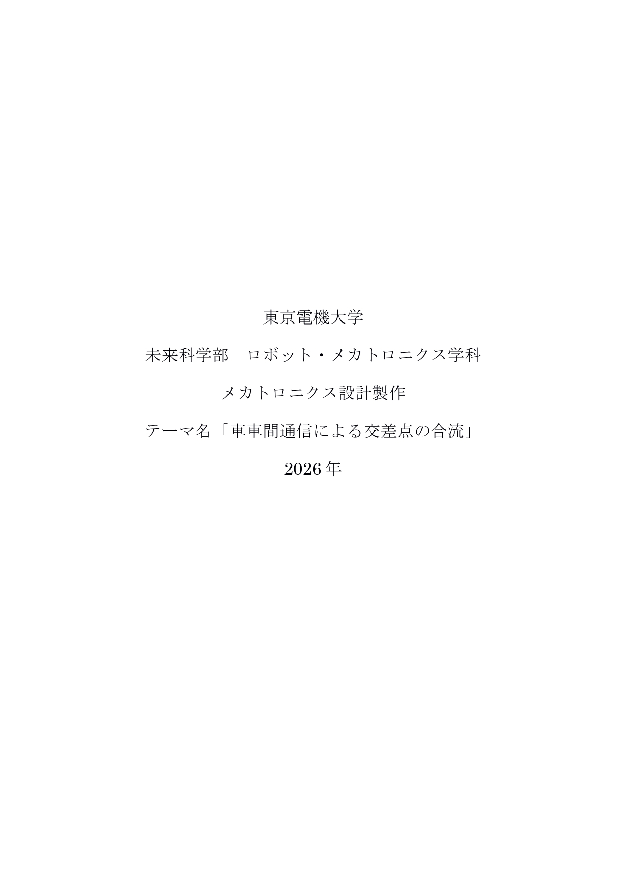
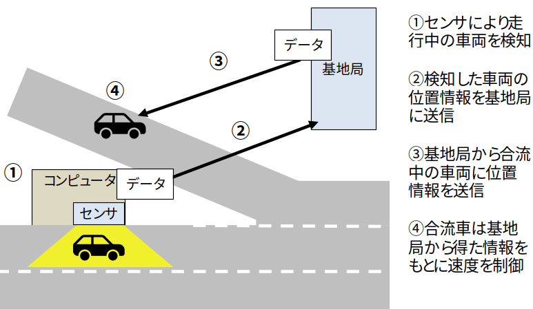
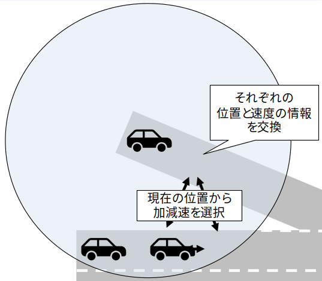
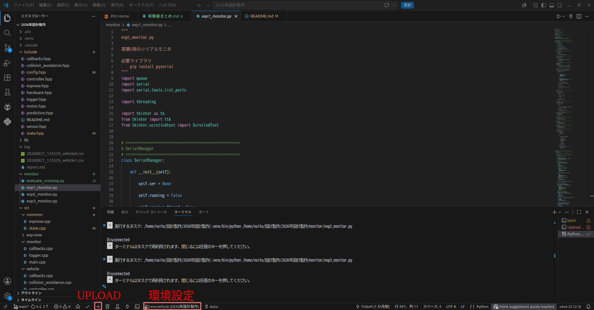
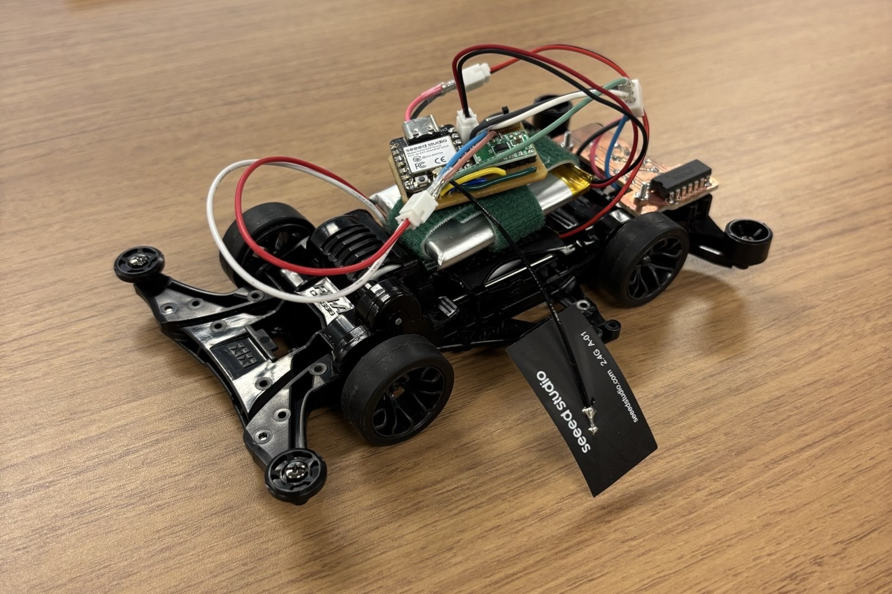

## 目次

1. [目的](#1-目的)
2. [概要](#2-概要)
3. [基礎知識](#3-基礎知識)
   - 3.1 [ESP-NOW](#31-esp-now)
   - 3.2 [V2I/V2V通信](#32-v2iv2v通信)
4. [マイコンへのプログラムアップロード](#4-マイコンへのプログラムアップロード)
5. [実験内容](#5-実験内容)
   - 5.1 [実験環境構築](#51-実験環境構築)
   - 5.2 [ESP-NOWによる無線通信実験](#52-esp-nowによる無線通信実験)
   - 5.3 [車両走行実験](#53-車両走行実験)
   - 5.4 [衝突回避実験](#54-衝突回避実験)
6. [考察](#5-考察)
   - 6.1 [考察課題1](#51-考察課題1)
   - 6.2 [考察課題2](#52-考察課題2)
   - 6.3 [ 考察課題3(任意)](#53-考察課題3任意)
7. [付録：使用プログラム](#6-付録)
<div style="page-break-after: always;"></div>


## 1. 目的

本実験では，通信可能な2台の車両を用いて，交差点での合流を想定した衝突回避実験を行う．これを通じて，無線通信に関する理解を深めることを目的とする．


## 2. 概要

本実験では，無線アドホック通信を用いて，交差点で合流する2台の車両の衝突回避を実現する．手順は以下の3段階で構成される．

1. 無線通信に関するプログラムを作成し，基礎知識を習得する．
2. 実機の車両を走行させるプログラムを作成し，その動作を確認する．
3. 走行距離や通信範囲などの条件を変えながらプログラムを実行し，実機での動作を確認する．


## 3. 基礎知識

### 3.1 ESP-NOW

ESP-NOWは，Espressif社が開発した無線通信プロトコルである．Wi-Fiの物理層およびMAC層を利用し，アクセスポイントやルータを介さずに端末間で直接通信を行うことができる．ESP32シリーズをはじめとするEspressif社製SoCで利用可能であり，低遅延かつ省電力なデバイス間通信を実現できる．

ESP-NOWはWi-Fiドライバ上で動作する独自プロトコルであるため，利用に先立ってWi-FiをStation（STA）モードに設定する必要がある．通信相手はMACアドレスによって識別され，送信先デバイスはあらかじめPeerとして登録しておかなければならない．

1回の送信で扱えるデータサイズは最大250 Bであり，送信データはバイト列として渡す必要がある．実際の送受信処理はWi-Fiドライバによって非同期に実行されるため，送信完了時および受信時にはそれぞれ送信コールバック関数・受信コールバック関数が呼び出され，通信結果や受信データが処理される．

### 3.2 V2I/V2V通信

近年，交差点への合流時に多発する衝突事故の防止策として，自動運転技術による衝突回避の研究が盛んに行われている．そのなかで通信速度が担保された手法として，**V2I（Vehicle to Infrastructure）通信**が挙げられる．図1にV2I通信の全体像を示す．

V2I通信は，車両を検知したセンサが基地局を介して加速車線の車両へデータを送信し，加速車線の車両がそのデータをもとに速度を制御する手法である．高速道路を走行中の車両がセンサの前を通過すると，センサはその車両のデータを基地局へ送信する．基地局は，合流を予定している車両へ受信データを転送する．これにより，自動運転による合流が可能になる．

しかし，V2I通信の実現には合流地点へのセンサや基地局の設置が必要であり，コストがかかるという課題がある．そこで本実験では，車両同士が自身の情報を直接やり取りする**V2V（Vehicle to Vehicle）通信**を用い，基地局や外部センサに依存しない自動運転による合流を実現する．図2にV2V通信のイメージを示す．

<div style="text-align: center;">
   <br>
   図1 V2I通信のイメージ図
</div>
<br>

<div style="text-align: center;">
   <br>
   図2 V2V通信のイメージ図
</div>

<div style="page-break-after: always;"></div>


## 4. マイコンへのプログラムアップロード

プログラムをSeeed XIAO ESP32C3へアップロードする手順を以下に示す．

1. 図4の環境設定で示す箇所をクリックし，クイックアクセスバーからアップロード環境を選択する．
2. PCとマイコンをケーブルで接続する．
3. 図4のUPLOADで示す箇所をクリックし，アップロード（upload）を実行する．

<div style="text-align: center;">
   <br>
   図4　環境設定とuploadの場所
</div>

アップロード時に以下のようなエラーが表示される場合がある．

``` bash
A fatal error occurred: Could not open **, the port doesn't exist
```

この場合，一度ケーブルを抜き，マイコンのBOOTボタンを押し込んだ状態でケーブルを再接続すると解決することがある．

<div style="page-break-after: always;"></div>


## 5. 実験内容

本実験では，車両が保有する各種情報を無線通信によって交換し，衝突せずに合流を行うシステムを構築する．図3に実験で使用する車両を示す．Seeed XIAO ESP32C3を搭載した2台の車両が，現在の速度と合流地点までの距離情報を交換し，その情報をもとに各車両が衝突判定と速度制御を行い，合流する．

<div style="text-align: center;">
   <br>
   図3　実験車両
</div>

実験は以下の3段階で構成する．

| 実験 | 内容 |
|------|------|
| 第1実験 | ESP-NOWの導通実験 |
| 第2実験 | 車両制御用コントローラの設計 |
| 第3実験 | 2台の車両による情報交換・速度制御・合流の実験（複数条件で動作確認） |

<div style="page-break-after: always;"></div>

### 5.1 実験環境構築

あらかじめ配布されたプロジェクトを展開し，実行環境を構築する．手順を以下に示す．

1. Visual Studio Codeを起動する．
2. 拡張機能として以下をインストールする．
   - Python
   - Pylance
   - Python Debugger
   - Python Environments
   - PlatformIO IDE
   - C/C++
   - C/C++ Extension Pack
3. 配布されたzipファイルを展開する．
4. 展開したプロジェクトフォルダをVisual Studio Codeで開く．
5. ターミナルを開き，OSに応じて以下を実行する．

**Windowsの場合**
```powershell
Set-ExecutionPolicy -Scope Process -ExecutionPolicy Bypass
.\setup.ps1
.\.venv\Scripts\Activate.ps1
```

**Linuxの場合**
```bash
chmod +x setup.sh
./setup.sh
source .venv/bin/activate
```
6. 環境設定を `env:test` にして，マイコンにアップロードする．
7. `monitor/exp0_monitor.py`を実行して動作を確認する．

<div style="page-break-after: always;"></div>

### 5.2 ESP-NOWによる無線通信実験

2台のSeeed XIAO ESP32C3を用いて，ESP-NOWによる通信実験を行う．

**準備**
- PC 2台，ESP32C3　2台を用意する．
- `src/espnow/main.cpp` の穴埋めを行う．
- 環境設定を `env:espnow` にして，2台のマイコンにアップロードする．

**手順**
1. マイコンをそれぞれのPCに接続し，`python/exp1_monitor.py` を実行する．
2. COMPORTでマイコンの接続ポートを選択し，Connectを押してシリアル通信を開始する．
3. HELLOを送信し合い，互いのMACアドレスを確認する．
4. 相手のMACアドレスへPINGを送信し，導通を確認する．
5. 相手のMACアドレスをAddPeerする．
6. 相手のMACアドレスへ再度PINGを送信し，導通を確認する．
7. 相手のMACアドレスへDATA REQUESTを送信し，ダミーデータの受信を確認する．
8. 計測終了後，Disconnectを押してシリアル通信を終了する．

<div style="page-break-after: always;"></div>

### 5.3 車両走行実験

実験車両を走行させ，目標速度に追従するコントローラを設計する．

**準備**
- `src/vehicle/controller.cpp` の `calculate_pid_pwm` 関数を設計する．
- モニタ用マイコンと実験車両を用意する．
- 直線コースを1本用意する．
- 環境設定を `env:vehicle` にして実験車両側マイコンへアップロードする．
- 環境設定を `env:monitor` にしてモニタ用マイコンへアップロードする．

**手順**
1. `python/exp2_monitor.py` を実行する．
2. COMPORTでマイコンの接続ポートを選択し，Connectを押してシリアル通信を開始する．
3. 実験車両のバッテリを接続し，電源を入れる．
4. 実験車両をコースに設置する．
5. 必要に応じてTarget Speedを設定し，SET SPEEDを押して送信する．
6. 必要に応じてKP，KI，KDを設定し，SET GAINを押して送信する．
7. STARTを送信し，計測を開始する．
8. FINISHを送信し，計測を終了する．
9. `log` ディレクトリに生成されたログデータを確認する．
10. 上記を繰り返し，コントローラのゲインを設計する．
11. 十分に目標へ追従するゲインが得られたら，その値を記録する．
12. 計測終了後，Disconnectを押してシリアル通信を終了する．

#### 追加実験・考察（任意）

モータを変更し，同様の手順でコントローラゲインを設計する．得られた結果から各モータの特性を類推し，本実験に最も適したモータについて考察する．
※本項目は時間を要するため，余裕がある場合にのみ行う．

<div style="page-break-after: always;"></div>

### 5.4 衝突回避実験

2台の実験車両を同時に走行させ，交差点への突入実験を行う．

**準備**
- 前回の実験で得られたゲインをもとに，`include/config.hpp` の `PID_KP_DEFAULT`，`PID_KI_DEFAULT`，`PID_KD_DEFAULT` を設定する．
- モニタ用マイコンと実験車両を用意する．
- 交差点コースを用意する．
- 環境設定を `env:vehicle` にして実験車両側マイコンへアップロードする．
- 環境設定を `env:monitor` にしてモニタ用マイコンへアップロードする．
- 設置したコースに応じて，`include/config.hpp` の以下の定数を設定する．


``` hpp
constexpr int32_t DIST_TO_INTERSECTION_ENTRY_MM  = 2500;  // 交差点進入位置までの距離（ミリメートル）
constexpr int32_t DIST_TO_INTERSECTION_EXIT_MM   = 200;   // 交差点退出位置までの距離（ミリメートル）

constexpr uint8_t SPEED_THRESHOLD_CM_S           = 5;     // 到着時間を計算しても良い速度閾値（センチメートル/秒）

constexpr float PID_KP_DEFAULT                   = 0.0F;   // 比例ゲインのデフォルト値
constexpr float PID_KI_DEFAULT                   = 0.0F;   // 積分ゲインのデフォルト値
constexpr float PID_KD_DEFAULT                   = 0.0F;   // 微分ゲインのデフォルト値

constexpr uint32_t TIME_MARGIN_US                = 500000;     // 交差時間のマージン（マイクロ秒）
```


**手順**
1. `python/exp3_monitor.py` を実行する．
2. COMPORTでマイコンの接続ポートを選択し，Connectを押してシリアル通信を開始する．
3. 実験車両のバッテリを接続し，電源を入れる．
4. 実験車両をコースに設置する．
5. `collision_flag` をOFFにしてSTARTを押し，計測を開始する．
6. 車両が衝突を回避することを確認し，FINISHを送信して計測を終了する．
7. `log` ディレクトリに生成されたログデータを確認する．
8. 計測終了後，Disconnectを押してシリアル通信を終了する．

<div style="page-break-after: always;"></div>


## 6. 考察

### 6.1 考察課題1

ESP-NOWがIPアドレスではなくMACアドレスによって通信相手を識別している理由を考察せよ．また，IPアドレスを用いた通信と比較した場合のESP-NOWの利点と欠点について述べよ．

### 6.2 考察課題2
実験用車両のプログラムの改善点を考案し，実装結果を説明せよ．

### 6.3 考察課題3(任意)

各モータの特性を類推し，本実験に最も適したモータについて考察する．追加実験を行わなかった場合には不要である．

<div style="page-break-after: always;"></div>

## 6. 付録
### A. ファイル構造

実験で使用したプロジェクトのファイル構造を図5に示す．

<!-- A begin auto generated appendix -->

```text
2026年設計製作/
├── include/
│   ├── callbacks.hpp
│   ├── collision_avoidance.hpp
│   ├── config.hpp
│   ├── controller.hpp
│   ├── espnow.hpp
│   ├── hardware.hpp
│   ├── logger.hpp
│   ├── motor.hpp
│   ├── prediction.hpp
│   ├── README.md
│   ├── sensor.hpp
│   └── state.hpp
├── monitor/
│   ├── exp0_monitor.py
│   ├── exp1_monitor.py
│   ├── exp2_monitor.py
│   └── exp3_monitor.py
├── platformio.ini
├── README.md
├── requirements.txt
├── setup.dat
├── setup.ps1
├── setup.sh
└── src/
    ├── common/
    │   ├── espnow.cpp
    │   └── state.cpp
    ├── esp-now/
    │   └── main.cpp
    ├── monitor/
    │   ├── callbacks.cpp
    │   ├── logger.cpp
    │   └── main.cpp
    ├── serial_test/
    │   └── main.cpp
    └── vehicle/
        ├── callbacks.cpp
        ├── collision_avoidance.cpp
        ├── controller.cpp
        ├── main.cpp
        ├── motor.cpp
        ├── prediction.cpp
        └── sensor.cpp
```

<p style="text-align: center;">図5 プロジェクトのファイル構造</p>

<!-- A end auto generated appendix -->

### B. プログラム

実験で使用したプログラムを以下に示す．

<!-- B begin auto generated appendix -->

<p style="text-align: center;">リスト1 <code>README.md</code></p>

````text
# CollisionAvoidance

## 必要なソフト

- VSCode
- PlatformIO IED
- C/C++
- C/C++ Extension Pack
- Python
- Pylance
- Python Debugger
- Python Enviroments

- Python 3.11以上

## 初回セットアップ

Linux

```bash
sudo chmod +x setup.sh 
./setup.sh
source .venv/bin/activate
```
Windows

```bash
Set-ExecutionPolicy -Scope Process -ExecutionPolicy Bypass
.\setup.ps1
.\.venv\Scripts\Activate.ps1
```
````

<p style="text-align: center;">リスト2 <code>include/README.md</code></p>

```text
# Coding Naming Convention

本プロジェクトでは、車両制御システムの可読性・保守性・安全性を確保するため、以下の命名規則を適用する。

---

## 1. 基本方針

- 変数名・関数名は原則 `snake_case` とする。
- 定数名は `UPPER_SNAKE_CASE` とする。
- 型名・構造体名は `PascalCase` とする。
- 変数名には、可能な限り「何を表す値か」が分かる名前を付ける。
- 物理量を表す変数には、原則として単位を名前に含める。
- 略語を多用せず、意味が明確な名前を使用する。
- 同じ意味を持つ変数には、プロジェクト全体で同じ命名を使用する。

---

## 2. 命名規則一覧

| 対象 | 命名規則 | 例 |
|---|---|---|
| 変数 | `snake_case` | `current_speed_cm_s` |
| ローカル変数 | `snake_case` | `remaining_distance_mm` |
| グローバル変数 | `snake_case` | `current_speed_cm_s` |
| 定数 | `UPPER_SNAKE_CASE` | `MAX_SPEED_CM_S` |
| `constexpr` | `UPPER_SNAKE_CASE` | `CONTROL_INTERVAL_MS` |
| 関数 | `snake_case` | `calculate_current_speed_cm_s()` |
| 構造体 | `PascalCase` | `StatusData` |
| `enum class` | `PascalCase` | `PacketType` |
| enum値 | `UPPER_SNAKE_CASE` | `STATUS` |
| ヘッダファイル | `snake_case` | `collision_avoidance.hpp` |
| ISR | `snake_case` + `_isr` | `sensor_isr()` |

---

## 3. 物理量の単位

物理量を表す変数・定数・関数の戻り値には、可能な限り単位を名前に含める。

### 時間

| 単位 | 接尾辞 | 例 |
|---|---|---|
| マイクロ秒 | `_us` | `timestamp_us` |
| ミリ秒 | `_ms` | `CONTROL_INTERVAL_MS` |
| 秒 | `_s` | `timeout_s` |

### 距離

| 単位 | 接尾辞 | 例 |
|---|---|---|
| ミリメートル | `_mm` | `LINE_PITCH_MM` |
| センチメートル | `_cm` | `distance_cm` |

### 速度

速度は `[cm/s]` を基本単位とする。

### 周波数

周波数には_HZを使用する

### PWM

PWM値には _PWM を使用する。

## 4. 時間に関する命名

「時刻」と「所要時間」を区別する。

### 時刻

特定の時点を表す値には timestamp または time を使用する。

### 所要時間

ある地点・イベントまでに必要な時間には time_to_ を使用する。

### 時間間隔

2つのイベント間の時間には interval を使用する。

## 5. bool型の命名

bool 型の変数は、状態や条件が分かるように以下の接頭辞を使用する。

接頭辞	用途	例
is_	状態	is_running
has_	所有・存在	has_data
can_	可能か	can_start
should_	実行すべきか	should_stop

## 6. インデックス・カウンタ

### インデックス

配列やテーブルの位置を表す変数には _index を使用する。

### カウンタ

個数や回数を表す場合は _count を使用する。

## 7. 配列・バッファ

配列名には、格納しているデータの種類を明確にする。

## 8. 関数

関数名は snake_case とし、原則として「動作 + 対象」の形式にする。

## 9. 関数名に単位を含める

関数の戻り値が物理量の場合、戻り値の単位を関数名に含める。

## 10. 定数

設定値・固定値は constexpr を基本とし、UPPER_SNAKE_CASE を使用する．

## 11. 型

用途に応じて固定幅整数型を使用する。

| 型          | 用途                    |
| ---------- | --------------------- |
| `uint8_t`  | PWM、パケット種別など、0～255の整数 |
| `uint16_t` | 比較的小さい非負整数            |
| `uint32_t` | 時刻、時間、非負の大きな整数        |
| `int32_t`  | 速度、距離、符号付き計算値         |
| `float`    | PIDゲイン、PID計算          |
| `bool`     | 状態・フラグ                |

## 12. const の使用

変更しないローカル変数には原則として const を付ける。
計算途中で変更する必要がある変数には const を付けない。

## 13. グローバル変数

グローバル変数は必要最小限とする。

他の .cpp ファイルから参照する必要がある変数のみ、ヘッダファイルで extern 宣言する。
原則として、他のモジュールから直接アクセスする必要がない変数は extern にしない。

## 14. モジュール内部変数

PIDの積分値など、特定のモジュールだけが使用する内部状態は、その .cpp ファイル内で管理する。

## 16. マジックナンバー

意味を持つ数値をコード中に直接記述しない。
単位変換など、意味が明確な定数も可能な限り名前を付ける。

## 17. ファイル名

ヘッダ・ソースファイルのファイル名は snake_case を使用する。

## 18. 例外

以下の場合は、上記規則よりも外部仕様・ライブラリ仕様を優先する。

 - Arduino / ESP32 APIが要求する名前
 - ESP-NOWなど通信プロトコルで定義された名称
 - 外部ライブラリのAPI
 - 実験・評価用データフォーマットで既に定義された名称

ただし、プロジェクト内部の変数については可能な限り本規則に従う。

## 19. 命名判断の優先順位

変数名を決める際は、以下の順で考える。

 - 何の値か
 - 単位は何か
 - 現在値・目標値・最大値など、値の役割は何か
 - 他のモジュールと共有する値か
 - プロジェクト内の既存の命名と一致しているか
```

<p style="text-align: center;">リスト3 <code>include/callbacks.hpp</code></p>

```cpp
#ifndef CALLBACK_H
#define CALLBACK_H
#include "config.hpp"

void on_receive_data(const uint8_t *mac_addr,const uint8_t *data,int len);

#endif 
```

<p style="text-align: center;">リスト4 <code>include/collision_avoidance.hpp</code></p>

```cpp
#ifndef COLLISION_AVOIDANCE_H
#define COLLISION_AVOIDANCE_H

#include "config.hpp"

int32_t calculate_collision_avoidance_speed_cm_s(uint32_t current_time_us);

#endif // COLLISION_AVOIDANCE_H
```

<p style="text-align: center;">リスト5 <code>include/config.hpp</code></p>

```cpp
#ifndef CONFIG_H
#define CONFIG_H
#include <Arduino.h>

#include "hardware.hpp"
#include "state.hpp"

// ============================================================
// 車両パラメータ (Vehicle)
// ============================================================
constexpr int32_t LINE_PITCH_MM                  = 10;    // ラインのピッチ（ミリメートル）
constexpr int32_t VEHICLE_LENGTH_MM              = 160;   // 車両の長さ（ミリメートル）
constexpr uint8_t VEHICLE_COUNT                  = 2;     // ビークルの台数

// 交差点関連の距離
constexpr int32_t DIST_TO_INTERSECTION_ENTRY_MM  = 2500;  // 交差点進入位置までの距離（ミリメートル）
constexpr int32_t DIST_TO_INTERSECTION_EXIT_MM   = 200;   // 交差点退出位置までの距離（ミリメートル）

// ============================================================
// 速度パラメータ (Speed)
// ============================================================
constexpr int32_t DEFAULT_SPEED_CM_S             = 100;   // デフォルト速度（センチメートル/秒）
constexpr int32_t MAX_SPEED_CM_S                 = 200;   // 最大速度（センチメートル/秒）
constexpr int32_t MIN_SPEED_CM_S                 = 20;    // 最小速度（センチメートル/秒）
constexpr uint8_t SPEED_THRESHOLD_CM_S           = 5;     // 到着時間を計算しても良い速度閾値（センチメートル/秒）

// ============================================================
// PID制御 (PID Control)
// ============================================================
constexpr float PID_KP_DEFAULT                   = 2.0F;   // 比例ゲインのデフォルト値
constexpr float PID_KI_DEFAULT                   = 0.0004F;   // 積分ゲインのデフォルト値
constexpr float PID_KD_DEFAULT                   = 1.0F;   // 微分ゲインのデフォルト値
constexpr float PID_MAX_INTEGRAL                 = 100000.0F; // 積分項の最大値

// ============================================================
// 制御ループ (Control Loop)
// ============================================================
constexpr uint32_t CONTROL_INTERVAL_MS           = 10;     // 制御ループの間隔（ミリ秒）

// ============================================================
// フィルタ (Filters)
// ============================================================
constexpr uint8_t FILTER_WINDOW_SIZE             = 10;     // フィルタのウィンドウサイズ


// ============================================================
// PWM制限 (PWM Limits)
// ============================================================
constexpr uint8_t MAX_PWM                        = 200;    // 最大PWM値
constexpr uint8_t MIN_PWM                        = 10;     // 最小PWM値

// ============================================================
// 時間関連定数 (Timing)
// ============================================================
constexpr uint32_t INVALID_TIME_US               = UINT32_MAX; // 無効な時間を表す定数（マイクロ秒）
constexpr uint32_t TIME_MARGIN_US                = 500000;     // 交差時間のマージン（マイクロ秒）
constexpr uint32_t RUN_TIME_LIMIT_US             = 5000000;    // 走行時間の上限（マイクロ秒）
constexpr uint32_t SENSOR_TIMEOUT_US             = 200000;     // センサーのタイムアウト時間（マイクロ秒）
constexpr uint32_t INTERSECTION_HOLD_TIME_US     = 200000;     // 交差点通過後の保持時間（マイクロ秒）

#endif // CONFIG_H
```

<p style="text-align: center;">リスト6 <code>include/controller.hpp</code></p>

```cpp
#ifndef CONTROLLER_H
#define CONTROLLER_H
#include "config.hpp"
uint8_t calculate_pid_pwm(int32_t current_speed_cm_s, int32_t target_speed_cm_s);
void reset_controller();

#endif
```

<p style="text-align: center;">リスト7 <code>include/espnow.hpp</code></p>

```cpp
#ifndef ESPNOW_HPP
#define ESPNOW_HPP
#include"config.hpp"

// パケット種類
//==================================================
enum class PacketType : uint8_t{
    START = 0,
    FINISH,
    STATUS,
    SET_SPEED,
    GAIN
};

// パケット
//==================================================
struct PacketHead{
    PacketType type;
};

struct StartPacket{
    PacketHead header;
    bool is_collision;
    bool is_lonely;
};

struct FinishPacket{
    PacketHead header;
};

struct StatusPacket{
    PacketHead header;

    StatusData payload;
};

struct SetSpeedPacket{
    PacketHead header;
    uint32_t target_speed_cm_s;   
};

struct GainPacket{
    PacketHead header;
    float kp;
    float ki;
    float kd;
};

void setup_esp_now();

void send_start(bool collision,bool lonely);

void send_finish();

void send_status(const StatusData &data);

void send_speed(const int speed);

void send_gain(float kp,float ki,float kd);

#endif
```

<p style="text-align: center;">リスト8 <code>include/hardware.hpp</code></p>

```cpp
#ifndef HARDWARE_HPP
#define HARDWARE_HPP

#include <Arduino.h>

// Hardware
constexpr int PHASE_PIN = D5;                   // モータの回転方向を制御するピン
constexpr int ENABLE_PIN = D3;                  // モータの有効化を制御するピン
constexpr int SENSOR_PIN = D6;                  // センサー接続ピン
constexpr int RUN_SWITCH_PIN = D2;              // ランスイッチ接続ピン

// PWM
constexpr int PWM_CHANNEL = 0;                  // PWMチャンネル番号
constexpr int PWM_FREQUENCY_HZ = 20000;         // PWM周波数（Hz）
constexpr int PWM_RESOLUTION_BITS = 8;          // PWM分解能（ビット数）

#endif // HARDWARE_HPP
```

<p style="text-align: center;">リスト9 <code>include/logger.hpp</code></p>

```cpp
#ifndef LOGGER_HPP
#define LOGGER_HPP
#include"config.hpp"

void setup_logger();
void open_log_file();
void write_log(int32_t vehicle_index,const StatusData& data);
void close_log_file();
void send_log();

#endif
```

<p style="text-align: center;">リスト10 <code>include/motor.hpp</code></p>

```cpp
#ifndef MOTOR_H
#define MOTOR_H
#include "config.hpp"
void setup_motor();
void write_motor_pwm(uint8_t pwm);
void brake_motor();

#endif
```

<p style="text-align: center;">リスト11 <code>include/prediction.hpp</code></p>

```cpp
#ifndef PREDICTION_H
#define PREDICTION_H

#include "config.hpp"

uint32_t predict_time_to_intersection_us();
uint32_t predict_time_to_exit_intersection_us();

#endif
```

<p style="text-align: center;">リスト12 <code>include/sensor.hpp</code></p>

```cpp
#ifndef SENSOR_H
#define SENSOR_H
#include "config.hpp"
void setup_sensor();
void clear_sensor_interval_buffer();
uint32_t calculate_current_speed_cm_s();

#endif
```

<p style="text-align: center;">リスト13 <code>include/state.hpp</code></p>

```cpp
#ifndef STATE_HPP
#define STATE_HPP

#include <Arduino.h>

struct StatusData {
    uint32_t timestamp_us;                          // タイムスタンプ（マイクロ秒）
    uint32_t speed_cm_s;                            // 速度（センチメートル毎秒）
    uint32_t target_speed_cm_s;                     // 目標速度（センチメートル毎秒）
    uint32_t line_count;                            // ラインカウント
    uint8_t pwm;                                    // PWM値（0-255）
    uint32_t time_to_enter_intersection_us;         // 交差点に入るまでの時間（マイクロ秒）
    uint32_t time_to_exit_intersection_us;          // 交差点を出るまでの時間（マイクロ秒）
};

extern volatile int32_t sensor_log_index;               // センサーのログインデックス
extern volatile uint32_t line_count;                     // ラインカウント
extern volatile uint8_t current_pwm;                    // 現在のPWM値

extern volatile bool is_started;                        // ビークルがスタートしたかどうかのフラグ
extern volatile bool should_save;                       // ログを保存するかどうかのフラグ

extern volatile uint32_t start_time_us;                 // スタート時間（マイクロ秒）
extern volatile uint32_t last_time_us;                  // センサが最後に更新された時間（マイクロ秒）
extern volatile uint32_t intersection_entry_time_us;          // 交差点に入る時間（マイクロ秒）
extern volatile uint32_t intersection_exit_time_us ;    // 交差点から退出する時間（マイクロ秒）


extern volatile int32_t current_speed_cm_s;             // 現在の速度（センチメートル毎秒）
extern volatile int32_t target_speed_cm_s;              // 目標速度（センチメートル毎秒）
extern volatile int32_t default_target_speed_cm_s;        // 最初の目標速度（センチメートル毎秒）

extern volatile uint32_t self_enter_time_us;                 // 自分の交差点に入る時間（マイクロ秒）
extern volatile uint32_t self_exit_time_us;                  // 自分の交差点を出る時間（マイクロ秒）

extern volatile uint32_t other_enter_time_us;                 // 他の車両の交差点に入る時間（マイクロ秒）
extern volatile uint32_t other_exit_time_us;                  // 他の車両の交差点を出る時間（マイクロ秒）
extern volatile uint32_t other_timestamp_us;                  // 他の車両のタイムスタンプ（マイクロ秒）

extern volatile bool is_running;                        // ビークルが走行中かどうかのフラグ
extern volatile bool is_collision_detected;             // ビークルが意図的衝突モードかどうかのフラグ
extern volatile bool is_lonely;                         // ビークルが独立制御モードかどうかのフラグ
extern volatile bool is_logging;                        // ログを記録中かどうかのフラグ

extern float pid_kp;                                    // PID制御の比例ゲイン
extern float pid_ki;                                    // PID制御の積分ゲイン
extern float pid_kd;                                    // PID制御の微分ゲイン

#endif // STATE_HPP
```

<p style="text-align: center;">リスト14 <code>monitor/exp0_monitor.py</code></p>

```python
"""
exp0_monitor.py

ESP32-C3 動作確認用シリアルモニタ

Python -> ESP32-C3 : HELLO
ESP32-C3 -> Python : HELLO FROM ESP32-C3

必要ライブラリ
    pip install pyserial
"""

import queue
import serial
import serial.tools.list_ports

import threading

import tkinter as tk
from tkinter import ttk
from tkinter.scrolledtext import ScrolledText


# =====================================================
# SerialManager
# =====================================================
class SerialManager:

    def __init__(self):

        self.ser = None

        self.running = False

        self.receive_thread = None

        # GUIへ渡すメッセージ
        self.message_queue = queue.Queue()

    # -------------------------------------------------
    # GUIへログ表示
    # -------------------------------------------------
    def log(self, text):

        print(text)

        self.message_queue.put(text)

    # -------------------------------------------------
    # GUI用メッセージ取得
    # -------------------------------------------------
    def get_message(self):

        try:
            return self.message_queue.get_nowait()

        except queue.Empty:
            return None

    # -------------------------------------------------
    # COMポート一覧取得
    # -------------------------------------------------
    @staticmethod
    def get_ports():

        ports = serial.tools.list_ports.comports()

        return [port.device for port in ports]

    # -------------------------------------------------
    # 接続
    # -------------------------------------------------
    def connect(self, port, baudrate=115200):

        if self.ser is not None:
            return True

        try:

            self.ser = serial.Serial(
                port=port,
                baudrate=baudrate,
                timeout=0.1
            )

            self.running = True

            self.receive_thread = threading.Thread(
                target=self.receive_loop,
                daemon=True
            )

            self.receive_thread.start()

            self.log(f"Connected : {port}")

            return True

        except Exception as e:

            self.log(f"Connection Error : {e}")

            return False

    # -------------------------------------------------
    # 切断
    # -------------------------------------------------
    def disconnect(self):

        self.running = False

        if self.ser is not None:

            try:
                self.ser.close()

            except:
                pass

            self.ser = None

        self.log("Disconnected")

    # -------------------------------------------------
    # HELLO送信
    # -------------------------------------------------
    def send_hello(self):

        if self.ser is None:
            self.log("Not connected")

            return

        try:

            self.ser.write(b"HELLO\n")

            self.log("> HELLO")

        except Exception as e:

            self.log(f"Send Error : {e}")

    # -------------------------------------------------
    # 受信スレッド
    # -------------------------------------------------
    def receive_loop(self):

        while self.running:

            if self.ser is None:
                break

            try:

                line = self.ser.readline()

                if len(line) == 0:
                    continue

                text = line.decode(
                    errors="ignore"
                ).strip()

                if text == "":
                    continue

                self.log("< " + text)

            except Exception as e:

                if self.running:
                    self.log(f"Receive Error : {e}")

                break


# =====================================================
# MonitorGUI
# =====================================================
class MonitorGUI:

    # =================================================
    # 初期化
    # =================================================
    def __init__(self):

        self.serial = SerialManager()

        self.root = tk.Tk()

        self.root.title("ESP32-C3 Serial Test")

        self.root.geometry("600x450")

        # -------------------------------------------------
        # COMポート
        # -------------------------------------------------
        top = ttk.Frame(self.root)

        top.pack(
            fill="x",
            padx=10,
            pady=10
        )

        ttk.Label(
            top,
            text="COM Port"
        ).pack(side="left")

        self.port_var = tk.StringVar()

        self.port_box = ttk.Combobox(
            top,
            width=20,
            textvariable=self.port_var,
            state="readonly"
        )

        self.port_box.pack(
            side="left",
            padx=5
        )

        ttk.Button(
            top,
            text="Refresh",
            command=self.refresh_ports
        ).pack(side="left")

        self.connect_button = ttk.Button(
            top,
            text="Connect",
            command=self.connect
        )

        self.connect_button.pack(
            side="left",
            padx=10
        )

        # -------------------------------------------------
        # HELLOボタン
        # -------------------------------------------------
        hello_frame = ttk.Frame(self.root)

        hello_frame.pack(
            fill="x",
            padx=10,
            pady=10
        )

        ttk.Button(
            hello_frame,
            text="Send HELLO",
            command=self.send_hello,
            width=20
        ).pack()

        # -------------------------------------------------
        # ログ
        # -------------------------------------------------
        ttk.Label(
            self.root,
            text="Log"
        ).pack(
            anchor="w",
            padx=10
        )

        self.log = ScrolledText(
            self.root,
            height=18,
            state="disabled"
        )

        self.log.pack(
            fill="both",
            expand=True,
            padx=10,
            pady=10
        )

        # -------------------------------------------------
        # COM一覧取得
        # -------------------------------------------------
        self.refresh_ports()

        # -------------------------------------------------
        # Queue監視開始
        # -------------------------------------------------
        self.root.after(
            50,
            self.update_log
        )

        # -------------------------------------------------
        # ×ボタン
        # -------------------------------------------------
        self.root.protocol(
            "WM_DELETE_WINDOW",
            self.close
        )

    # =================================================
    # COM一覧更新
    # =================================================
    def refresh_ports(self):

        ports = self.serial.get_ports()

        self.port_box["values"] = ports

        if len(ports) > 0:

            self.port_box.current(0)

    # =================================================
    # 接続
    # =================================================
    def connect(self):

        if self.serial.ser is None:

            port = self.port_var.get()

            if port == "":
                return

            if self.serial.connect(port):

                self.connect_button.config(
                    text="Disconnect",
                    command=self.disconnect
                )

        else:

            self.disconnect()

    # =================================================
    # 切断
    # =================================================
    def disconnect(self):

        self.serial.disconnect()

        self.connect_button.config(
            text="Connect",
            command=self.connect
        )

    # =================================================
    # HELLO
    # =================================================
    def send_hello(self):

        self.serial.send_hello()

    # =================================================
    # ログ更新
    # =================================================
    def update_log(self):

        while True:

            message = self.serial.get_message()

            if message is None:
                break

            self.append_log(message)

        self.root.after(
            50,
            self.update_log
        )

    # =================================================
    # ログ追加
    # =================================================
    def append_log(self, text):

        self.log.configure(
            state="normal"
        )

        self.log.insert(
            tk.END,
            text + "\n"
        )

        self.log.see(
            tk.END
        )

        self.log.configure(
            state="disabled"
        )

    # =================================================
    # 終了処理
    # =================================================
    def close(self):

        try:
            self.serial.disconnect()

        except:
            pass

        self.root.destroy()

    # =================================================
    # GUI開始
    # =================================================
    def run(self):

        self.root.mainloop()


# =====================================================
# main
# =====================================================
def main():

    app = MonitorGUI()

    app.run()


if __name__ == "__main__":
    main()
```

<p style="text-align: center;">リスト15 <code>monitor/exp1_monitor.py</code></p>

```python
"""
exp1_monitor.py

実験1用のシリアルモニタ

必要ライブラリ
    pip install pyserial
"""
import queue
import serial
import serial.tools.list_ports

import threading

import tkinter as tk
from tkinter import ttk
from tkinter.scrolledtext import ScrolledText


# =====================================================
# SerialManager
# =====================================================
class SerialManager:

    def __init__(self):

        self.ser = None

        self.running = False

        self.receive_thread = None

        # GUIへ渡すメッセージ
        self.message_queue = queue.Queue()

    # -------------------------------------------------
    # GUIへログ表示
    # -------------------------------------------------
    def log(self, text):

        print(text)

        self.message_queue.put(text)

    # -------------------------------------------------
    # GUI用メッセージ取得
    # -------------------------------------------------
    def get_message(self):

        try:
            return self.message_queue.get_nowait()
        except queue.Empty:
            return None

    # -------------------------------------------------
    # COMポート一覧取得
    # -------------------------------------------------
    @staticmethod
    def get_ports():

        ports = serial.tools.list_ports.comports()

        return [port.device for port in ports]

    # -------------------------------------------------
    # 接続
    # -------------------------------------------------
    def connect(self, port, baudrate=115200):

        if self.ser is not None:
            return True

        try:

            self.ser = serial.Serial(
                port=port,
                baudrate=baudrate,
                timeout=0.1
            )

            self.running = True

            self.receive_thread = threading.Thread(
                target=self.receive_loop,
                daemon=True
            )

            self.receive_thread.start()

            self.log(f"Connected : {port}")

            return True

        except Exception as e:

            self.log(f"Connection Error : {e}")

            return False

    # -------------------------------------------------
    # 切断
    # -------------------------------------------------
    def disconnect(self):

        self.running = False

        if self.ser is not None:

            try:
                self.ser.close()
            except:
                pass

            self.ser = None

        self.log("Disconnected")

    # -------------------------------------------------
    # コマンド送信
    # -------------------------------------------------
    def send(self, command):

        if self.ser is None:
            return

        try:

            self.ser.write((command + "\n").encode())

            self.log("> " + command)

        except Exception as e:

            self.log(f"Send Error : {e}")

    # -------------------------------------------------
    # HELLO送信（ブロードキャスト）
    # -------------------------------------------------
    def send_hello(self):

        self.send("HELLO")

    # -------------------------------------------------
    # Peer登録
    # -------------------------------------------------
    def send_addpeer(self, mac):

        self.send(f"addpeer {mac}")

    # -------------------------------------------------
    # PING送信
    # -------------------------------------------------
    def send_ping(self, mac):

        self.send(f"PING {mac}")

    # -------------------------------------------------
    # DATA_REQ送信
    # -------------------------------------------------
    def send_datareq(self, mac):

        self.send(f"DATAREQ {mac}")

    # -------------------------------------------------
    # 受信スレッド
    # -------------------------------------------------
    def receive_loop(self):

        while self.running:

            if self.ser is None:
                break

            try:

                line = self.ser.readline()

                if len(line) == 0:
                    continue

                text = line.decode(
                    errors="ignore"
                ).strip()

                if text == "":
                    continue

                self.log(text)

            except Exception as e:

                self.log(f"Receive Error : {e}")

                self.disconnect()

                break


# =====================================================
# MonitorGUI
# =====================================================
class MonitorGUI:

    #==================================================
    # 初期化
    #==================================================
    def __init__(self):

        self.serial = SerialManager()

        self.root = tk.Tk()
        self.root.title("ESP-NOW Monitor (実験1)")
        self.root.geometry("700x550")

        #------------------------------
        # COMポート
        #------------------------------
        top = ttk.Frame(self.root)
        top.pack(fill="x", padx=10, pady=10)

        ttk.Label(
            top,
            text="COM Port"
        ).pack(side="left")

        self.port_var = tk.StringVar()

        self.port_box = ttk.Combobox(
            top,
            width=20,
            textvariable=self.port_var,
            state="readonly"
        )

        self.port_box.pack(side="left", padx=5)

        ttk.Button(
            top,
            text="Refresh",
            command=self.refresh_ports
        ).pack(side="left")

        self.connect_button = ttk.Button(
            top,
            text="Connect",
            command=self.connect
        )

        self.connect_button.pack(side="left", padx=10)

        #------------------------------
        # HELLO（ブロードキャスト）
        #------------------------------
        hello_frame = ttk.Frame(self.root)
        hello_frame.pack(fill="x", padx=10, pady=5)

        ttk.Button(
            hello_frame,
            text="HELLO (Broadcast)",
            command=self.send_hello,
            width=25
        ).pack(side="left")

        #------------------------------
        # MACアドレス指定 + 各種送信
        #------------------------------
        mac_frame = ttk.Frame(self.root)
        mac_frame.pack(fill="x", padx=10, pady=10)

        ttk.Label(
            mac_frame,
            text="MAC Address"
        ).pack(side="left")

        self.mac_var = tk.StringVar(value="XX:XX:XX:XX:XX:XX")

        self.mac_entry = ttk.Entry(
            mac_frame,
            width=20,
            textvariable=self.mac_var
        )

        self.mac_entry.pack(side="left", padx=5)

        button_frame = ttk.Frame(self.root)
        button_frame.pack(fill="x", padx=10)

        ttk.Button(
            button_frame,
            text="Add Peer",
            command=self.send_addpeer,
            width=15
        ).pack(side="left", padx=5, pady=5)

        ttk.Button(
            button_frame,
            text="PING",
            command=self.send_ping,
            width=15
        ).pack(side="left", padx=5, pady=5)

        ttk.Button(
            button_frame,
            text="DATA REQUEST",
            command=self.send_datareq,
            width=15
        ).pack(side="left", padx=5, pady=5)

        #------------------------------
        # ログ表示
        #------------------------------
        ttk.Label(
            self.root,
            text="Log"
        ).pack(anchor="w", padx=10)

        self.log = ScrolledText(
            self.root,
            height=20,
            state="disabled"
        )

        self.log.pack(
            fill="both",
            expand=True,
            padx=10,
            pady=10
        )

        # COM一覧取得
        self.refresh_ports()

        # Queue監視開始
        self.root.after(
            50,
            self.update_log
        )

        # ×ボタン
        self.root.protocol(
            "WM_DELETE_WINDOW",
            self.close
        )

    #==================================================
    # COM一覧更新
    #==================================================
    def refresh_ports(self):

        ports = self.serial.get_ports()

        self.port_box["values"] = ports

        if len(ports) > 0:
            self.port_box.current(0)

    #==================================================
    # 接続
    #==================================================
    def connect(self):

        if self.serial.ser is None:

            port = self.port_var.get()

            if port == "":
                return

            if self.serial.connect(port):

                self.connect_button.config(
                    text="Disconnect",
                    command=self.disconnect
                )

        else:

            self.disconnect()

    #==================================================
    # 切断
    #==================================================
    def disconnect(self):

        self.serial.disconnect()

        self.connect_button.config(
            text="Connect",
            command=self.connect
        )

    #==================================================
    # HELLO
    #==================================================
    def send_hello(self):

        self.serial.send_hello()

    #==================================================
    # Add Peer
    #==================================================
    def send_addpeer(self):

        mac = self.mac_var.get().strip()

        if mac == "":
            self.append_log("Invalid MAC Address")
            return

        self.serial.send_addpeer(mac)

    #==================================================
    # PING
    #==================================================
    def send_ping(self):

        mac = self.mac_var.get().strip()

        if mac == "":
            self.append_log("Invalid MAC Address")
            return

        self.serial.send_ping(mac)

    #==================================================
    # DATA REQUEST
    #==================================================
    def send_datareq(self):

        mac = self.mac_var.get().strip()

        if mac == "":
            self.append_log("Invalid MAC Address")
            return

        self.serial.send_datareq(mac)

    #==================================================
    # ログ更新
    #==================================================
    def update_log(self):

        while True:

            message = self.serial.get_message()

            if message is None:
                break

            self.append_log(message)

        # 50ms後に再度チェック
        self.root.after(50, self.update_log)

    #==================================================
    # ログ追加
    #==================================================
    def append_log(self, text):

        self.log.configure(state="normal")

        self.log.insert(tk.END, text + "\n")

        self.log.see(tk.END)

        self.log.configure(state="disabled")

    #==================================================
    # 終了処理
    #==================================================
    def close(self):

        try:
            self.serial.disconnect()
        except:
            pass

        self.root.destroy()

    #==================================================
    # GUI開始
    #==================================================
    def run(self):

        self.root.mainloop()


# =====================================================
# main
# =====================================================
def main():
    app = MonitorGUI()
    app.run()


if __name__ == "__main__":
    main()
```

<p style="text-align: center;">リスト16 <code>monitor/exp2_monitor.py</code></p>

```python
"""
exp2_monitor.py

実験2用のシリアルモニタ

必要ライブラリ
    pip install pyserial
"""
import csv
import queue
import serial
import os
import serial.tools.list_ports

import threading
from datetime import datetime

import tkinter as tk
from tkinter import ttk
from tkinter.scrolledtext import ScrolledText

import matplotlib
matplotlib.use("TkAgg")
from matplotlib.figure import Figure
from matplotlib.backends.backend_tkagg import (
    FigureCanvasTkAgg,
    NavigationToolbar2Tk
)


# =====================================================
# SerialManager
# =====================================================
class SerialManager:

    def __init__(self):

        self.ser = None

        self.running = False

        self.receive_thread = None

        # GUIへ渡すメッセージ
        self.message_queue = queue.Queue()

        # 保存されたCSVパスをGUIへ渡す(グラフ表示用)
        self.plot_queue = queue.Queue()

        # CSV受信
        self.receiving_csv = False
        self.current_vehicle = None
        self.csv_buffer = []

        # 転送予定ファイル数の管理
        self.expected_count = None
        self.received_count = 0

    # -------------------------------------------------
    # GUIへログ表示
    # -------------------------------------------------
    def log(self, text):

        print(text)

        self.message_queue.put(text)

    # -------------------------------------------------
    # GUI用メッセージ取得
    # -------------------------------------------------
    def get_message(self):

        try:
            return self.message_queue.get_nowait()
        except queue.Empty:
            return None

    # -------------------------------------------------
    # GUI用:保存されたCSVファイルパス取得
    # -------------------------------------------------
    def get_plot_request(self):

        try:
            return self.plot_queue.get_nowait()
        except queue.Empty:
            return None

    # -------------------------------------------------
    # COMポート一覧取得
    # -------------------------------------------------
    @staticmethod
    def get_ports():

        ports = serial.tools.list_ports.comports()

        return [port.device for port in ports]

    # -------------------------------------------------
    # 接続
    # -------------------------------------------------
    def connect(self, port, baudrate=115200):

        if self.ser is not None:
            return True

        try:

            self.ser = serial.Serial(
                port=port,
                baudrate=baudrate,
                timeout=0.1
            )

            self.running = True

            self.receive_thread = threading.Thread(
                target=self.receive_loop,
                daemon=True
            )

            self.receive_thread.start()

            self.log(f"Connected : {port}")

            return True

        except Exception as e:

            self.log(f"Connection Error : {e}")

            return False

    # -------------------------------------------------
    # 切断
    # -------------------------------------------------
    def disconnect(self):

        self.running = False

        if self.ser is not None:

            try:
                self.ser.close()
            except:
                pass

            self.ser = None

        self.log("Disconnected")

    # -------------------------------------------------
    # コマンド送信
    # -------------------------------------------------
    def send(self, command):

        if self.ser is None:
            return

        try:

            self.ser.write((command + "\n").encode())

            self.log("> " + command)

        except Exception as e:

            self.log(f"Send Error : {e}")

    # -------------------------------------------------
    # START
    # -------------------------------------------------
    def send_start(self):

        self.send("start lonery")

    # -------------------------------------------------
    # FINISH
    # -------------------------------------------------
    def send_finish(self):

        self.send("finish")

    # -------------------------------------------------
    # SET SPEED
    # -------------------------------------------------
    def send_speed(self, speed):

        self.send(f"speed {speed}")

    # -------------------------------------------------
    # SET GAIN
    # -------------------------------------------------
    def send_gain(self, kp, ki, kd):
        self.send(f"gain {kp} {ki} {kd}")

    # -------------------------------------------------
    # 受信スレッド
    # -------------------------------------------------
    def receive_loop(self):

        while self.running:

            if self.ser is None:
                break

            try:

                line = self.ser.readline()

                if len(line) == 0:
                    continue

                text = line.decode(
                    errors="ignore"
                ).strip()

                if text == "":
                    continue

                # -------------------------------
                # 転送予定件数
                # -------------------------------
                if text.startswith("COUNT"):

                    parts = text.split()

                    if len(parts) == 2:
                        self.expected_count = int(parts[1])
                    else:
                        self.expected_count = None

                    self.received_count = 0

                    self.log(f"Expecting {self.expected_count} log file(s)")

                    continue

                # -------------------------------
                # CSV開始
                # -------------------------------
                if text.startswith("BEGIN"):

                    parts = text.split()

                    if len(parts) == 2:
                        self.current_vehicle = int(parts[1])
                    else:
                        self.current_vehicle = 0

                    self.receiving_csv = True
                    self.csv_buffer.clear()

                    self.log(f"Receiving Vehicle {self.current_vehicle}")

                    continue

                # -------------------------------
                # CSV終了
                # -------------------------------
                if text.startswith("END"):

                    self.save_csv(self.current_vehicle)

                    self.receiving_csv = False
                    self.current_vehicle = None

                    self.received_count += 1

                    # 予定件数すべて受信したらACKを返す
                    if (self.expected_count is not None
                            and self.received_count >= self.expected_count):

                        self.send("ACK")
                        self.expected_count = None
                        self.received_count = 0

                    continue

                # -------------------------------
                # 全転送終了
                # -------------------------------
                if text == "ALL LOGS DELETED":
                    self.log(text)
                    continue

                # -------------------------------
                # CSV受信中
                # -------------------------------
                if self.receiving_csv:
                    self.csv_buffer.append(text)
                else:
                    self.log(text)

            except Exception as e:

                self.log(f"Receive Error : {e}")

                self.disconnect()

                break

    # -------------------------------------------------
    # CSV保存
    # -------------------------------------------------
    def save_csv(self, vehicle):

        os.makedirs("log", exist_ok=True)

        timestamp = datetime.now().strftime("%Y%m%d_%H%M%S")

        filename = os.path.join(
            "log",
            f"{timestamp}_vehicle{vehicle}.csv"
        )

        try:

            with open(filename, "w", encoding="utf-8") as f:

                for line in self.csv_buffer:
                    f.write(line + "\n")

            self.log(f"Saved : {filename}")

            # 保存が終わったらGUI側でグラフ表示できるように通知
            self.plot_queue.put(filename)

        except Exception as e:

            self.log(f"Save Error : {e}")


# =====================================================
# MonitorGUI
# =====================================================
class MonitorGUI:

    #==================================================
    # 初期化
    #==================================================
    def __init__(self):

        self.serial = SerialManager()

        # 直近にSETしたPIDゲイン (グラフのタイトル表示用)
        self.last_gain = {"kp": None, "ki": None, "kd": None}

        self.root = tk.Tk()
        self.root.title("ESP32 Monitor")
        self.root.geometry("700x550")

        #------------------------------
        # COMポート
        #------------------------------
        top = ttk.Frame(self.root)
        top.pack(fill="x", padx=10, pady=10)

        ttk.Label(
            top,
            text="COM Port"
        ).pack(side="left")

        self.port_var = tk.StringVar()

        self.port_box = ttk.Combobox(
            top,
            width=20,
            textvariable=self.port_var,
            state="readonly"
        )

        self.port_box.pack(side="left", padx=5)

        ttk.Button(
            top,
            text="Refresh",
            command=self.refresh_ports
        ).pack(side="left")

        self.connect_button = ttk.Button(
            top,
            text="Connect",
            command=self.connect
        )

        self.connect_button.pack(side="left", padx=10)

        #------------------------------
        # 操作ボタン
        #------------------------------
        button_frame = ttk.Frame(self.root)
        button_frame.pack(fill="x", padx=10)

        self.start_button = ttk.Button(
            button_frame,
            text="START",
            command=self.send_start,
            width=25
        )

        self.start_button.pack(pady=5)

        self.finish_button = ttk.Button(
            button_frame,
            text="FINISH",
            command=self.send_finish,
            width=25
        )

        self.finish_button.pack(pady=5)

        #------------------------------
        # 目標速度設定
        #------------------------------
        speed_frame = ttk.Frame(self.root)
        speed_frame.pack(fill="x", padx=10, pady=10)

        ttk.Label(
            speed_frame,
            text="Target Speed"
        ).pack(side="left")

        self.speed_var = tk.StringVar(value="100")

        self.speed_entry = ttk.Entry(
            speed_frame,
            width=10,
            textvariable=self.speed_var
        )

        self.speed_entry.pack(side="left", padx=5)

        ttk.Button(
            speed_frame,
            text="SET SPEED",
            command=self.send_speed
        ).pack(side="left", padx=5)

        # ------------------------------
        # PIDゲイン設定
        # ------------------------------
        gain_frame = ttk.Frame(self.root)
        gain_frame.pack(fill="x", padx=10, pady=5)

        ttk.Label(
            gain_frame,
            text="KP"
        ).pack(side="left")

        self.kp_var = tk.StringVar(value="1.0")
        ttk.Entry(
            gain_frame,
            width=8,
            textvariable=self.kp_var
        ).pack(side="left", padx=3)

        ttk.Label(
            gain_frame,
            text="KI"
        ).pack(side="left")

        self.ki_var = tk.StringVar(value="1.0")
        ttk.Entry(
            gain_frame,
            width=8,
            textvariable=self.ki_var
        ).pack(side="left", padx=3)

        ttk.Label(
            gain_frame,
            text="KD"
        ).pack(side="left")

        self.kd_var = tk.StringVar(value="0.0")
        ttk.Entry(
            gain_frame,
            width=8,
            textvariable=self.kd_var
        ).pack(side="left", padx=3)

        ttk.Button(
            gain_frame,
            text="SET GAIN",
            command=self.send_gain
        ).pack(side="left", padx=10)

        #------------------------------
        # ログ表示
        #------------------------------
        ttk.Label(
            self.root,
            text="Log"
        ).pack(anchor="w", padx=10)

        self.log = ScrolledText(
            self.root,
            height=20,
            state="disabled"
        )

        self.log.pack(
            fill="both",
            expand=True,
            padx=10,
            pady=10
        )

        # COM一覧取得
        self.refresh_ports()

        # Queue監視開始
        self.root.after(
            50,
            self.update_log
        )

        # ×ボタン
        self.root.protocol(
            "WM_DELETE_WINDOW",
            self.close
        )

    #==================================================
    # COM一覧更新
    #==================================================
    def refresh_ports(self):

        ports = self.serial.get_ports()

        self.port_box["values"] = ports

        if len(ports) > 0:
            self.port_box.current(0)

    #==================================================
    # 接続
    #==================================================
    def connect(self):

        if self.serial.ser is None:

            port = self.port_var.get()

            if port == "":
                return

            if self.serial.connect(port):

                self.connect_button.config(
                    text="Disconnect",
                    command=self.disconnect
                )

        else:

            self.disconnect()

    #==================================================
    # 切断
    #==================================================
    def disconnect(self):

        self.serial.disconnect()

        self.connect_button.config(
            text="Connect",
            command=self.connect
        )

    #==================================================
    # START
    #==================================================
    def send_start(self):

        self.serial.send_start()

    #==================================================
    # FINISH
    #==================================================
    def send_finish(self):

        self.serial.send_finish()

    #==================================================
    # SET SPEED
    #==================================================
    def send_speed(self):

        try:
            speed = int(self.speed_var.get())
        except ValueError:
            self.append_log("Invalid speed")
            return

        self.serial.send_speed(speed)

    #==================================================
    # SET GAIN
    #==================================================
    def send_gain(self):

        try:
            kp = float(self.kp_var.get())
            ki = float(self.ki_var.get())
            kd = float(self.kd_var.get())
        except ValueError:
            self.append_log("Invalid gain")
            return

        # グラフタイトル表示用に直近のゲインを保持
        self.last_gain = {"kp": kp, "ki": ki, "kd": kd}

        self.serial.send_gain(kp, ki, kd)

    #==================================================
    # ログ更新
    #==================================================
    def update_log(self):

        while True:

            message = self.serial.get_message()

            if message is None:
                break

            self.append_log(message)

        # 保存されたCSVがあればグラフウィンドウを開く
        while True:

            filepath = self.serial.get_plot_request()

            if filepath is None:
                break

            self.show_graph(filepath)

        # 50ms後に再度チェック
        self.root.after(50, self.update_log)

    #==================================================
    # ログ追加
    #==================================================
    def append_log(self, text):

        self.log.configure(state="normal")

        self.log.insert(tk.END, text + "\n")

        self.log.see(tk.END)

        self.log.configure(state="disabled")

    #==================================================
    # グラフ表示
    # (Time_us を横軸に Speed_cm_s / Target_speed_cm_s / PWM を
    #  1つのグラフにまとめて表示する)
    #==================================================
    def show_graph(self, filepath):

        # 表示したい列名 (CSVヘッダーと照合するキー)
        columns = {
            "time_us": "Time_us",
            "speed_cm_s": "Speed_cm_s",
            "target_speed_cm_s": "Target_speed_cm_s",
            "pwm": "PWM",
        }

        data = {key: [] for key in columns}

        row_count = 0
        skip_count = 0

        try:

            # utf-8-sig : 先頭にBOMが付いていても取り除いて読める
            with open(filepath, "r", encoding="utf-8-sig", newline="") as f:

                reader = csv.reader(f)

                header = next(reader, None)

                if header is None:
                    self.append_log(f"Graph Read Error : Empty file ({filepath})")
                    return

                # 列名前後の空白を除去し、大小文字を無視してインデックスを探す
                header_clean = [h.strip() for h in header]
                header_lower = [h.lower() for h in header_clean]

                idx = {}

                try:
                    for key, name in columns.items():
                        idx[key] = header_lower.index(name.lower())
                except ValueError:
                    self.append_log(
                        f"Graph Read Error : 必要な列が見つかりません "
                        f"(検出したヘッダー: {header_clean})"
                    )
                    return

                max_idx = max(idx.values())

                for row in reader:

                    row_count += 1

                    if len(row) <= max_idx:
                        skip_count += 1
                        continue

                    try:
                        values = {
                            key: float(row[i].strip())
                            for key, i in idx.items()
                        }
                    except ValueError:
                        skip_count += 1
                        continue

                    for key in columns:
                        data[key].append(values[key])

        except Exception as e:
            self.append_log(f"Graph Read Error : {e}")
            return

        if len(data["time_us"]) == 0:
            self.append_log(
                f"Graph Data Empty : {filepath} "
                f"(header={header_clean}, rows_read={row_count}, skipped={skip_count})"
            )
            return

        if skip_count > 0:
            self.append_log(
                f"Graph Warning : {skip_count}/{row_count} rows skipped in {filepath}"
            )

        # ------------------------------
        # タイトル用のゲイン文字列
        # ------------------------------
        gain = self.last_gain

        if gain["kp"] is None:
            gain_text = "KP=?, KI=?, KD=?"
        else:
            gain_text = f"KP={gain['kp']}, KI={gain['ki']}, KD={gain['kd']}"

        # ------------------------------
        # 別ウィンドウ作成
        # ------------------------------
        graph_win = tk.Toplevel(self.root)
        graph_win.title(f"Graph - {os.path.basename(filepath)}")
        graph_win.geometry("800x600")

        fig = Figure(figsize=(7, 5.5), dpi=100)
        ax = fig.add_subplot(111)

        # Speed / Target Speed は左軸 (cm/s)
        line1, = ax.plot(
            data["time_us"], data["speed_cm_s"],
            label="Speed_cm_s", color="tab:blue", linewidth=2.2
        )
        line2, = ax.plot(
            data["time_us"], data["target_speed_cm_s"],
            label="Target_speed_cm_s", color="tab:orange",
            linestyle="--", linewidth=2.2
        )

        ax.set_xlabel("Time_us")
        ax.set_ylabel("Speed [cm/s],PWM")
        ax.grid(True)

        line3, = ax.plot(
            data["time_us"], data["pwm"],
            label="PWM", color="yellow", linewidth=2.5, alpha=0.9
        )

        lines = [line1, line2, line3]
        ax.legend(lines, [l.get_label() for l in lines], loc="upper right")

        ax.set_title(
            f"{os.path.basename(filepath)}\n{gain_text}"
        )

        fig.tight_layout()

        canvas = FigureCanvasTkAgg(fig, master=graph_win)
        canvas.draw()
        canvas.get_tk_widget().pack(fill="both", expand=True)

        toolbar = NavigationToolbar2Tk(canvas, graph_win)
        toolbar.update()
        canvas.get_tk_widget().pack(fill="both", expand=True)

    #==================================================
    # 終了処理
    #==================================================
    def close(self):

        try:
            self.serial.disconnect()
        except:
            pass

        self.root.destroy()

    #==================================================
    # GUI開始
    #==================================================
    def run(self):

        self.root.mainloop()


# =====================================================
# main
# =====================================================
def main():
    app = MonitorGUI()
    app.run()


if __name__ == "__main__":
    main()
```

<p style="text-align: center;">リスト17 <code>monitor/exp3_monitor.py</code></p>

```python
"""
exp3_monitor.py

実験3用シリアルモニタ

必要ライブラリ
    pip install pyserial matplotlib
"""
import queue
import serial
import os
import serial.tools.list_ports

import threading
from datetime import datetime

import tkinter as tk
from tkinter import ttk
from tkinter.scrolledtext import ScrolledText

import matplotlib
matplotlib.use("TkAgg")
from matplotlib.figure import Figure
from matplotlib.backends.backend_tkagg import FigureCanvasTkAgg


# =====================================================
# SerialManager
# =====================================================
class SerialManager:

    def __init__(self):

        self.ser = None

        self.running = False

        self.receive_thread = None

        # GUIへ渡すメッセージ
        self.message_queue = queue.Queue()

        # GUIへ渡すプロット用データ（車両ごとの (Time_us, Time_us+EnterTime_us, Target_speed_cm_s) データ）
        self.plot_queue = queue.Queue()

        # CSV受信
        self.receiving_csv = False
        self.current_vehicle = None
        self.csv_buffer = []

        # 転送予定ファイル数の管理
        self.expected_count = None
        self.received_count = 0

        # 今回のセッションで受信した各車両のプロット用データ
        # { vehicle_id: [(Time_us, Time_us+EnterTime_us, Target_speed_cm_s), ...], ... }
        self.vehicle_data = {}


    # -------------------------------------------------
    # GUIへログ表示
    # -------------------------------------------------
    def log(self, text):

        print(text)

        self.message_queue.put(text)

    # -------------------------------------------------
    # GUI用メッセージ取得
    # -------------------------------------------------
    def get_message(self):

        try:
            return self.message_queue.get_nowait()
        except queue.Empty:
            return None

    # -------------------------------------------------
    # GUI用プロットデータ取得
    # -------------------------------------------------
    def get_plot_data(self):

        try:
            return self.plot_queue.get_nowait()
        except queue.Empty:
            return None

    # -------------------------------------------------
    # COMポート一覧取得
    # -------------------------------------------------
    @staticmethod
    def get_ports():

        ports = serial.tools.list_ports.comports()

        return [port.device for port in ports]

    # -------------------------------------------------
    # 接続
    # -------------------------------------------------
    def connect(self, port, baudrate=115200):

        if self.ser is not None:
            return True

        try:

            self.ser = serial.Serial(
                port=port,
                baudrate=baudrate,
                timeout=0.1
            )

            self.running = True

            self.receive_thread = threading.Thread(
                target=self.receive_loop,
                daemon=True
            )

            self.receive_thread.start()

            self.log(f"Connected : {port}")

            return True

        except Exception as e:

            self.log(f"Connection Error : {e}")

            return False

    # -------------------------------------------------
    # 切断
    # -------------------------------------------------
    def disconnect(self):

        self.running = False

        if self.ser is not None:

            try:
                self.ser.close()
            except:
                pass

            self.ser = None

        self.log("Disconnected")

    # -------------------------------------------------
    # コマンド送信
    # -------------------------------------------------
    def send(self, command):

        if self.ser is None:
            return

        try:

            self.ser.write((command + "\n").encode())

            self.log("> " + command)

        except Exception as e:

            self.log(f"Send Error : {e}")

    # -------------------------------------------------
    # START（衝突フラグに応じて分岐）
    # -------------------------------------------------
    def send_start(self, collision):

        if collision:
            self.send("start collision")
        else:
            self.send("start")

    # -------------------------------------------------
    # FINISH
    # -------------------------------------------------
    def send_finish(self):

        self.send("finish")

    # -------------------------------------------------
    # 受信スレッド
    # -------------------------------------------------
    def receive_loop(self):

        while self.running:

            if self.ser is None:
                break

            try:

                line = self.ser.readline()

                if len(line) == 0:
                    continue

                text = line.decode(
                    errors="ignore"
                ).strip()

                if text == "":
                    continue

                # -------------------------------
                # 転送予定件数
                # -------------------------------
                if text.startswith("COUNT"):

                    parts = text.split()

                    if len(parts) == 2:
                        self.expected_count = int(parts[1])
                    else:
                        self.expected_count = None

                    self.received_count = 0

                    # 新しいセッション開始のため、前回分のプロットデータをクリア
                    self.vehicle_data = {}

                    self.log(f"Expecting {self.expected_count} log file(s)")

                    continue


                # -------------------------------
                # CSV開始
                # -------------------------------
                if text.startswith("BEGIN"):

                    parts = text.split()

                    if len(parts) == 2:
                        self.current_vehicle = int(parts[1])
                    else:
                        self.current_vehicle = 0

                    self.receiving_csv = True
                    self.csv_buffer.clear()

                    self.log(f"Receiving Vehicle {self.current_vehicle}")

                    continue

                # -------------------------------
                # CSV終了
                # -------------------------------
                if text.startswith("END"):

                    self.save_csv(self.current_vehicle)

                    self.parse_and_store(self.current_vehicle)

                    self.receiving_csv = False
                    self.current_vehicle = None

                    self.received_count += 1

                    # 予定件数すべて受信したらACKを返し、プロットデータをGUIへ渡す
                    if (self.expected_count is not None
                            and self.received_count >= self.expected_count):

                        self.send("ACK")

                        self.plot_queue.put(dict(self.vehicle_data))

                        self.expected_count = None
                        self.received_count = 0

                    continue

                # -------------------------------
                # 全転送終了
                # -------------------------------
                if text == "ALL LOGS DELETED":
                    self.log(text)
                    continue

                # -------------------------------
                # CSV受信中
                # -------------------------------
                if self.receiving_csv:
                    self.csv_buffer.append(text)
                else:
                    self.log(text)

            except Exception as e:

                self.log(f"Receive Error : {e}")

                self.disconnect()

                break

    # -------------------------------------------------
    # CSV保存
    # -------------------------------------------------
    def save_csv(self, vehicle):

        os.makedirs("log", exist_ok=True)

        timestamp = datetime.now().strftime("%Y%m%d_%H%M%S")

        filename = os.path.join(
            "log",
            f"{timestamp}_vehicle{vehicle}.csv"
        )

        try:

            with open(filename, "w", encoding="utf-8") as f:

                for line in self.csv_buffer:
                    f.write(line + "\n")

            self.log(f"Saved : {filename}")

        except Exception as e:

            self.log(f"Save Error : {e}")

    # -------------------------------------------------
    # CSVバッファをパースしてプロット用データに変換
    #   Time_us
    #   Time_us + EnterTime_us
    #   Target_speed_cm_s （列が無ければ None）
    # -------------------------------------------------
    def parse_and_store(self, vehicle):

        if not self.csv_buffer:
            self.vehicle_data[vehicle] = []
            return

        header = [h.strip() for h in self.csv_buffer[0].split(",")]

        try:
            time_idx = header.index("Time_us")
            enter_idx = header.index("EnterTime_us")
        except ValueError:
            self.log("CSV Parse Error : required columns not found in header")
            self.vehicle_data[vehicle] = []
            return

        # Target_speed_cm_s は無い場合もあるため任意扱い
        try:
            speed_idx = header.index("Target_speed_cm_s")
        except ValueError:
            speed_idx = None
            self.log("Target_speed_cm_s column not found (speed plot will be skipped)")

        data = []

        for line in self.csv_buffer[1:]:

            parts = line.split(",")

            required_max = max(time_idx, enter_idx)
            if speed_idx is not None:
                required_max = max(required_max, speed_idx)

            if len(parts) <= required_max:
                continue

            try:
                t = float(parts[time_idx])
                enter = float(parts[enter_idx])
            except ValueError:
                continue

            speed = None
            if speed_idx is not None:
                try:
                    speed = float(parts[speed_idx])
                except ValueError:
                    speed = None

            data.append((t, t + enter, speed))

        self.vehicle_data[vehicle] = data


# =====================================================
# MonitorGUI
# =====================================================
class MonitorGUI:

    #==================================================
    # 初期化
    #==================================================
    def __init__(self):

        self.serial = SerialManager()

        self.root = tk.Tk()
        self.root.title("ESP32 Monitor - Experiment 3")
        self.root.geometry("700x550")

        #------------------------------
        # COMポート
        #------------------------------
        top = ttk.Frame(self.root)
        top.pack(fill="x", padx=10, pady=10)

        ttk.Label(
            top,
            text="COM Port"
        ).pack(side="left")

        self.port_var = tk.StringVar()

        self.port_box = ttk.Combobox(
            top,
            width=20,
            textvariable=self.port_var,
            state="readonly"
        )

        self.port_box.pack(side="left", padx=5)

        ttk.Button(
            top,
            text="Refresh",
            command=self.refresh_ports
        ).pack(side="left")

        self.connect_button = ttk.Button(
            top,
            text="Connect",
            command=self.connect
        )

        self.connect_button.pack(side="left", padx=10)

        #------------------------------
        # 衝突フラグ（トグルスイッチ）
        #------------------------------
        collision_frame = ttk.Frame(self.root)
        collision_frame.pack(fill="x", padx=10, pady=5)

        ttk.Label(
            collision_frame,
            text="Collision Flag"
        ).pack(side="left")

        self.collision_var = tk.BooleanVar(value=False)

        self.collision_switch = ttk.Checkbutton(
            collision_frame,
            text="OFF",
            variable=self.collision_var,
            command=self.toggle_collision
        )

        self.collision_switch.pack(side="left", padx=10)

        #------------------------------
        # 操作ボタン
        #------------------------------
        button_frame = ttk.Frame(self.root)
        button_frame.pack(fill="x", padx=10, pady=10)

        self.start_button = ttk.Button(
            button_frame,
            text="START",
            command=self.send_start,
            width=25
        )

        self.start_button.pack(pady=5)

        self.finish_button = ttk.Button(
            button_frame,
            text="FINISH",
            command=self.send_finish,
            width=25
        )

        self.finish_button.pack(pady=5)

        #------------------------------
        # ログ表示
        #------------------------------
        ttk.Label(
            self.root,
            text="Log"
        ).pack(anchor="w", padx=10)

        self.log = ScrolledText(
            self.root,
            height=20,
            state="disabled"
        )

        self.log.pack(
            fill="both",
            expand=True,
            padx=10,
            pady=10
        )

        # COM一覧取得
        self.refresh_ports()

        # Queue監視開始
        self.root.after(
            50,
            self.update_log
        )

        # プロットデータ監視開始
        self.root.after(
            200,
            self.check_plot
        )

        # ×ボタン
        self.root.protocol(
            "WM_DELETE_WINDOW",
            self.close
        )

    #==================================================
    # COM一覧更新
    #==================================================
    def refresh_ports(self):

        ports = self.serial.get_ports()

        self.port_box["values"] = ports

        if len(ports) > 0:
            self.port_box.current(0)

    #==================================================
    # 接続
    #==================================================
    def connect(self):

        if self.serial.ser is None:

            port = self.port_var.get()

            if port == "":
                return

            if self.serial.connect(port):

                self.connect_button.config(
                    text="Disconnect",
                    command=self.disconnect
                )

        else:

            self.disconnect()

    #==================================================
    # 切断
    #==================================================
    def disconnect(self):

        self.serial.disconnect()

        self.connect_button.config(
            text="Connect",
            command=self.connect
        )

    #==================================================
    # 衝突フラグ切替表示
    #==================================================
    def toggle_collision(self):

        if self.collision_var.get():
            self.collision_switch.config(text="ON")
        else:
            self.collision_switch.config(text="OFF")

    #==================================================
    # START（衝突フラグの状態を反映）
    #==================================================
    def send_start(self):

        self.serial.send_start(self.collision_var.get())

    #==================================================
    # FINISH
    #==================================================
    def send_finish(self):

        self.serial.send_finish()

    #==================================================
    # ログ更新
    #==================================================
    def update_log(self):

        while True:

            message = self.serial.get_message()

            if message is None:
                break

            self.append_log(message)

        # 50ms後に再度チェック
        self.root.after(50, self.update_log)

    #==================================================
    # プロットデータ更新
    #==================================================
    def check_plot(self):

        data = self.serial.get_plot_data()

        if data is not None:
            self.show_plot(data)

        # 200ms後に再度チェック
        self.root.after(200, self.check_plot)

    #==================================================
    # ログ追加
    #==================================================
    def append_log(self, text):

        self.log.configure(state="normal")

        self.log.insert(tk.END, text + "\n")

        self.log.see(tk.END)

        self.log.configure(state="disabled")

    #==================================================
    # 車両分のデータをグラフ表示
    #   横軸 : Time_us
    #   縦軸 : Time_us + EnterTime_us
    #==================================================
    def show_plot(self, vehicle_data):

        if not vehicle_data:
            return

        self.show_enter_time_plot(vehicle_data)

    #==================================================
    # Time_us vs Time_us + EnterTime_us （2車両分を1グラフに）
    #   EnterTime_us が 0 の点はプロットしない
    #==================================================
    def show_enter_time_plot(self, vehicle_data):

        win = tk.Toplevel(self.root)
        win.title("Vehicle Time Plot")
        win.geometry("800x600")

        fig = Figure(figsize=(8, 6), dpi=100)
        ax = fig.add_subplot(111)

        plotted = False

        for vehicle in sorted(vehicle_data.keys()):

            data = vehicle_data[vehicle]

            if not data:
                continue

            # EnterTime_us == 0 （つまり y - x == 0）の行は除外
            filtered = [d for d in data if (d[1] - d[0]) != 0]

            if not filtered:
                continue

            xs = [d[0] for d in filtered]
            ys = [d[1] for d in filtered]

            ax.plot(
                xs,
                ys,
                marker="o",
                markersize=2,
                linewidth=1,
                label=f"Vehicle {vehicle}"
            )

            plotted = True

        ax.set_xlabel("Time_us")
        ax.set_ylabel("Time_us + EnterTime_us")
        ax.set_title("Vehicle Time_us vs Time_us + EnterTime_us")

        if plotted:
            ax.legend()

        ax.grid(True)

        canvas = FigureCanvasTkAgg(fig, master=win)
        canvas.draw()
        canvas.get_tk_widget().pack(fill="both", expand=True)

        toolbar_frame = ttk.Frame(win)
        toolbar_frame.pack(fill="x")

        try:
            from matplotlib.backends.backend_tkagg import NavigationToolbar2Tk
            toolbar = NavigationToolbar2Tk(canvas, toolbar_frame)
            toolbar.update()
        except Exception:
            pass

    #==================================================
    # 終了処理
    #==================================================
    def close(self):

        try:
            self.serial.disconnect()
        except:
            pass

        self.root.destroy()

    #==================================================
    # GUI開始
    #==================================================
    def run(self):

        self.root.mainloop()


# =====================================================
# main
# =====================================================
def main():
    app = MonitorGUI()
    app.run()


if __name__ == "__main__":
    main()
```

<p style="text-align: center;">リスト18 <code>platformio.ini</code></p>

```ini
[platformio]
default_envs = espnow

[env:base]
platform = espressif32@6.9.0
board = seeed_xiao_esp32c3
framework = arduino
monitor_speed = 115200
upload_speed = 115200

[env:test]
extends = env:base
build_src_filter = 
    +<serial_test/>

[env:espnow]
extends = env:base
build_src_filter = 
    +<esp-now/>

[env:vehicle]
extends = env:base
build_src_filter =
    +<common/>
    +<vehicle/>

[env:monitor]
extends = env:base
build_src_filter =
    +<common/>
    +<monitor/>
```

<p style="text-align: center;">リスト19 <code>requirements.txt</code></p>

```text
pyserial>=3.5
pandas>=2.2
matplotlib
```

<p style="text-align: center;">リスト20 <code>setup.dat</code></p>

```text
@echo off
setlocal

echo ========================================
echo        Project Setup
echo ========================================

REM --------------------------------------------------
REM Python Virtual Environment
REM --------------------------------------------------
if not exist ".venv" (
    echo.
    echo [1/4] Creating Python virtual environment...
    py -m venv .venv
) else (
    echo.
    echo [1/4] Python virtual environment already exists.
)

call .venv\Scripts\activate.bat

echo.
echo [2/4] Installing Python packages...

python -m pip install --upgrade pip
pip install -r requirements.txt

REM --------------------------------------------------
REM PlatformIO
REM --------------------------------------------------
echo.
echo [3/4] Checking PlatformIO...

if exist "%USERPROFILE%\.platformio\penv\Scripts\pio.exe" (
    set PIO=%USERPROFILE%\.platformio\penv\Scripts\pio.exe
) else (
    where pio >nul 2>nul
    if errorlevel 1 (
        echo.
        echo ERROR: PlatformIO not found.
        echo Please install the PlatformIO VSCode extension.
        exit /b 1
    )
    for /f "delims=" %%i in ('where pio') do (
        set PIO=%%i
        goto :found
    )
)

:found

echo Using: %PIO%

REM --------------------------------------------------
REM PlatformIO Environment
REM --------------------------------------------------
echo.
echo [4/4] Checking PlatformIO environments...

if not exist ".pio\build\vehicle" (
    echo Creating Vehicle environment...
    "%PIO%" run -e vehicle
) else (
    echo Vehicle environment already exists.
)

if not exist ".pio\build\monitor" (
    echo Creating Monitor environment...
    "%PIO%" run -e monitor
) else (
    echo Monitor environment already exists.
)

echo.
echo ========================================
echo  Setup Complete!
echo ========================================
echo.
echo To activate the Python environment:
echo.
echo .venv\Scripts\activate.bat

pause
```

<p style="text-align: center;">リスト21 <code>setup.ps1</code></p>

```powershell
$ErrorActionPreference = "Stop"

Write-Host "========================================"
Write-Host "       Project Setup"
Write-Host "========================================"

#--------------------------------------------------
# Python Virtual Environment
#--------------------------------------------------
if (-Not (Test-Path ".venv")) {
    Write-Host ""
    Write-Host "[1/4] Creating Python virtual environment..."
    py -m venv .venv
}
else {
    Write-Host ""
    Write-Host "[1/4] Python virtual environment already exists."
}


Write-Host ""
Write-Host "[2/4] Installing Python packages..."

$VenvPython = ".\.venv\Scripts\python.exe"

& $VenvPython -m pip install --upgrade pip
& $VenvPython -m pip install -r requirements.txt


#--------------------------------------------------
# PlatformIO
#--------------------------------------------------
Write-Host ""
Write-Host "[3/4] Checking PlatformIO..."

$PIO = $null

# PlatformIO Core
if (Test-Path "$env:USERPROFILE\.platformio\penv\Scripts\pio.exe") {
    $PIO = "$env:USERPROFILE\.platformio\penv\Scripts\pio.exe"
}
elseif (Get-Command pio -ErrorAction SilentlyContinue) {
    $PIO = (Get-Command pio).Source
}

if (-Not $PIO) {
    Write-Host ""
    Write-Host "ERROR: PlatformIO not found."
    Write-Host "Please install the PlatformIO VSCode extension."
    exit 1
}

Write-Host "Using: $PIO"

#--------------------------------------------------
# PlatformIO Environment
#--------------------------------------------------
Write-Host ""
Write-Host "[4/4] Checking PlatformIO environments..."

if (-Not (Test-Path ".pio\build\vehicle")) {
    Write-Host "Creating Vehicle environment..."
    & $PIO run -e vehicle
}
else {
    Write-Host "Vehicle environment already exists."
}

if (-Not (Test-Path ".pio\build\monitor")) {
    Write-Host "Creating Monitor environment..."
    & $PIO run -e monitor
}
else {
    Write-Host "Monitor environment already exists."
}

if (-Not (Test-Path ".pio\build\espnow")) {
    Write-Host "Creating espnow environment..."
    & $PIO run -e espnow
}
else {
    Write-Host "espnow environment already exists."
}

Write-Host ""
Write-Host "========================================"
Write-Host " Setup Complete!"
Write-Host "========================================"
Write-Host ""
Write-Host "To activate the Python environment:"
Write-Host ""
Write-Host ".\.venv\Scripts\Activate.ps1"
Write-Host ""
```

<p style="text-align: center;">リスト22 <code>setup.sh</code></p>

```bash
#!/bin/bash

set -e

echo "========================================"
echo "       Project Setup"
echo "========================================"

#--------------------------------------------------
# Python仮想環境
#--------------------------------------------------
if [ ! -d ".venv" ]; then
    echo ""
    echo "[1/4] Creating Python virtual environment..."
    python3 -m venv .venv
else
    echo ""
    echo "[1/4] Python virtual environment already exists."
fi

source .venv/bin/activate

echo ""
echo "[2/4] Installing Python packages..."

python -m pip install --upgrade pip
pip install -r requirements.txt

#--------------------------------------------------
# PlatformIO
#--------------------------------------------------
echo ""
echo "[3/4] Checking PlatformIO..."

if [ -x "$HOME/.platformio/penv/bin/pio" ]; then
    PIO="$HOME/.platformio/penv/bin/pio"
elif command -v pio >/dev/null 2>&1; then
    PIO=$(command -v pio)
else
    echo ""
    echo "ERROR: PlatformIO not found."
    echo "Please install the PlatformIO VSCode extension."
    exit 1
fi

echo "Using: $PIO"

#--------------------------------------------------
# PlatformIO Environment
#--------------------------------------------------
echo ""
echo "[4/4] Checking PlatformIO environments..."

if [ ! -d ".pio/build/vehicle" ]; then
    echo "Creating Vehicle environment..."
    "$PIO" run -e vehicle
else
    echo "Vehicle environment already exists."
fi

if [ ! -d ".pio/build/monitor" ]; then
    echo "Creating Monitor environment..."
    "$PIO" run -e monitor
else
    echo "Monitor environment already exists."
fi

echo ""
echo "========================================"
echo " Setup Complete!"
echo "========================================"
echo ""
echo "To activate the Python environment:"
echo ""
echo "source .venv/bin/activate"
echo ""
```

<p style="text-align: center;">リスト23 <code>src/common/espnow.cpp</code></p>

```cpp
#include<WiFi.h>
#include<esp_now.h>
#include "espnow.hpp"
#include "callbacks.hpp"

const uint8_t broadcastAddress[6] ={0xFF,0xFF,0xFF,0xFF,0xFF,0xFF};

//--------------------------------------------------
// ESPNOWセットアップ関数
//--------------------------------------------------
void setup_esp_now(){
    WiFi.mode(WIFI_STA);

    esp_now_init();

    esp_now_peer_info_t broadcast = {};
    memcpy(broadcast.peer_addr, broadcastAddress, 6);
    broadcast.channel = 0;
    broadcast.encrypt = false;

    esp_now_add_peer(&broadcast);

    esp_now_register_recv_cb(on_receive_data);
}

//--------------------------------------------------
// START送信関数
//--------------------------------------------------
void send_start(bool collision,bool lonely){
    StartPacket packet;

    packet.header.type = PacketType::START;
    packet.is_collision = collision;
    packet.is_lonely = lonely;

    esp_now_send(broadcastAddress,reinterpret_cast<uint8_t*>(&packet),sizeof(packet));
}

//--------------------------------------------------
// FINISH送信関数
//--------------------------------------------------
void send_finish(){
    FinishPacket packet;

    packet.header.type = PacketType::FINISH;

    esp_now_send(broadcastAddress,reinterpret_cast<uint8_t*>(&packet),sizeof(packet));
}

//--------------------------------------------------
// STATUS送信関数
//--------------------------------------------------
void send_status(const StatusData &data){
    StatusPacket packet;

    packet.header.type = PacketType::STATUS;
    packet.payload = data;

    esp_now_send(broadcastAddress,reinterpret_cast<uint8_t*>(&packet),sizeof(packet));
}

//--------------------------------------------------
// SETSPEED送信関数
//--------------------------------------------------
void send_speed(const int speed){
    SetSpeedPacket packet;
    packet.header.type=PacketType::SET_SPEED;
    packet.target_speed_cm_s = speed;
    esp_now_send(broadcastAddress,reinterpret_cast<uint8_t*>(&packet),sizeof(packet));
}

//--------------------------------------------------
// GAIN送信関数
//--------------------------------------------------
void send_gain(float kp,float ki,float kd){
    GainPacket packet;
    packet.header.type=PacketType::GAIN;
    packet.kp=kp;
    packet.ki=ki;
    packet.kd=kd;
    esp_now_send(broadcastAddress,reinterpret_cast<uint8_t*>(&packet),sizeof(packet));
}
```

<p style="text-align: center;">リスト24 <code>src/common/state.cpp</code></p>

```cpp
#include "config.hpp"

volatile int32_t sensor_log_index = 0;
volatile uint32_t line_count = 0;

volatile uint8_t current_pwm = 0;

volatile bool is_started = false;
volatile bool should_save = false;

volatile uint32_t start_time_us = 0;
volatile uint32_t last_time_us = 0;
volatile uint32_t intersection_entry_time_us = INVALID_TIME_US;    
volatile uint32_t intersection_exit_time_us = INVALID_TIME_US; 
volatile int32_t default_target_speed_cm_s = DEFAULT_SPEED_CM_S;
volatile int32_t current_speed_cm_s = 0;
volatile int32_t target_speed_cm_s = default_target_speed_cm_s;
volatile uint32_t self_enter_time_us = INVALID_TIME_US;
volatile uint32_t self_exit_time_us = INVALID_TIME_US;
volatile uint32_t other_enter_time_us = INVALID_TIME_US;
volatile uint32_t other_exit_time_us = INVALID_TIME_US;
volatile uint32_t other_timestamp_us = INVALID_TIME_US;

volatile bool is_running = false;
volatile bool is_collision_detected = false;
volatile bool is_lonely = false;
volatile bool is_logging = false;


float pid_kp=PID_KP_DEFAULT;
float pid_ki=PID_KI_DEFAULT;
float pid_kd=PID_KD_DEFAULT;
```

<p style="text-align: center;">リスト25 <code>src/esp-now/main.cpp</code></p>

```cpp
#include <Arduino.h>
#include <WiFi.h>
#include <esp_now.h>
#include "config.hpp"

// 実験1で使用する
// esp-nowの導通確認実験

void add_peer(const uint8_t *mac_addr);
void print_mac_address(const uint8_t *mac_addr);
void send_hello();
void send_ping(const uint8_t *mac_addr);
void send_pong(const uint8_t *mac_addr);
void send_data_request(const uint8_t *mac_addr);
void send_data(const uint8_t *mac_addr);
void on_data_recv(const uint8_t *mac_addr, const uint8_t *data, int len);

// ------------------------------
// コマンド文字列の固定長プレフィックス
// ------------------------------
constexpr size_t ADDPEER_PREFIX_LEN = 8;  // "addpeer "
constexpr size_t PING_PREFIX_LEN    = 5;  // "PING "
constexpr size_t DATAREQ_PREFIX_LEN = 8;  // "DATAREQ "

// ------------------------------
// ダミーデータ生成用パラメータ
// ------------------------------
constexpr int32_t DUMMY_SPEED_MIN_CM_S   = 500;
constexpr int32_t DUMMY_SPEED_RANGE_CM_S = 500;
constexpr uint8_t DUMMY_PWM_MIN          = 50;
constexpr uint8_t DUMMY_PWM_RANGE        = 100;
constexpr uint32_t DUMMY_ENTER_OFFSET_MS = 1000;
constexpr uint32_t DUMMY_EXIT_OFFSET_MS  = 500;

// PING/DATA_REQを送信した時刻（RTT計算用）
uint32_t ping_start_time_ms;
uint32_t data_start_time_ms;

// パケット種別（全パケット共通のヘッダとして使う）
enum class PacketType : uint8_t{
    HELLO,
    PING,
    PONG,
    DATA_REQ,   // データ要求
    DATA        // データ本体（ダミーデータ）
};

// パケットヘッダ
// すべてのパケットは先頭にこのヘッダを持つ
struct PacketHeader{
    PacketType type;
};

// ヘッダのみのパケット（HELLO, PING, PONG, DATA_REQ用）
struct Packet{
    PacketHeader header;
};

// データパケット（ヘッダ + ダミーデータ本体）
struct DataPacket{
    PacketHeader header;
    StatusData payload;
};

uint8_t broadcast_address[6] = {
    0xFF, 0xFF, 0xFF,
    0xFF, 0xFF, 0xFF
};

uint8_t unicast_address[6];

void setup(){
    // シリアル通信開始
    Serial.begin(115200);

    // Wi-FiをSTAモードに設定
    WiFi.mode(WIFI_STA);

    // ESP-NOW初期化
    if (esp_now_init() != ESP_OK){
        Serial.println("ESP-NOW Init Failed");
        while (true);
    }

    // コールバック関数登録
    esp_now_register_recv_cb(on_data_recv);

    // ブロードキャストアドレスをPeer登録
    add_peer(broadcast_address);

    Serial.println("ESP-NOW Ready");
}

//--------------------------------------------------
// Peer登録
//--------------------------------------------------
void add_peer(const uint8_t *mac_addr){
    Serial.print("Add Peer : ");
    print_mac_address(mac_addr);

    if(esp_now_is_peer_exist(mac_addr)){
        Serial.println("Peer already exists");
        return;
    }

    esp_now_peer_info_t peer_info = {};

    // peer_info.peer_addrにmac_addrを格納
    ①;

    peer_info.channel = 0;
    peer_info.encrypt = false;

    const esp_err_t result = esp_now_add_peer(&peer_info);

    if(result == ESP_OK){
        Serial.println("Peer Added");
    }
    else{
        Serial.print("Peer Add Failed : ");
        Serial.println(result);
    }
}

//--------------------------------------------------
// HELLO送信（ブロードキャスト）
//--------------------------------------------------
void send_hello(){
    Packet packet;
    packet.header.type = PacketType::HELLO;

    Serial.println();
    if(esp_now_send(broadcast_address, ②, sizeof(packet)) == ESP_OK){
        Serial.println("Send : HELLO");
    }
    else{
        Serial.println("HELLO Send Failed");
    }
    Serial.println();
}

//--------------------------------------------------
// MACアドレス表示
//--------------------------------------------------
void print_mac_address(const uint8_t *mac_addr){
    for (int i = 0; i < 6; i++){
        Serial.printf("%02X", mac_addr[i]);
        if (i != 5) Serial.print(":");
    }
    Serial.println();
}

//--------------------------------------------------
// PING送信（ユニキャスト）
//--------------------------------------------------
void send_ping(const uint8_t *mac_addr){
    Packet packet;
    packet.header.type = PacketType::PING;
    ping_start_time_ms = millis();

    Serial.println();
    Serial.print("Send : PING -> ");
    print_mac_address(mac_addr);

    if(esp_now_send(mac_addr, ②, sizeof(packet)) == ESP_OK){
        Serial.println("PING Send OK");
    }
    else{
        Serial.println("PING Send Failed");
    }
    Serial.println();
}


//--------------------------------------------------
// PONG送信（ユニキャスト）
//--------------------------------------------------
void send_pong(const uint8_t *mac_addr){
    Packet packet;
    packet.header.type = PacketType::PONG;

    Serial.print("Send : PONG -> ");
    print_mac_address(mac_addr);

    if(esp_now_send(mac_addr, ②, sizeof(packet)) == ESP_OK){
        Serial.println("PONG Send OK");
    }
    else{
        Serial.println("PONG Send Failed");
    }
}


//--------------------------------------------------
// DATA_REQ送信（ユニキャスト）
// 相手に対してデータ本体の送信を要求する
//--------------------------------------------------
void send_data_request(const uint8_t *mac_addr){
    Packet packet;
    packet.header.type = PacketType::DATA_REQ;
    data_start_time_ms = millis();

    Serial.println();
    Serial.print("Send : DATA_REQ -> ");
    print_mac_address(mac_addr);

    if(esp_now_send(mac_addr, ②, sizeof(packet)) == ESP_OK){
        Serial.println("DATA_REQ Send OK");
    }
    else{
        Serial.println("DATA_REQ Send Failed");
    }
    Serial.println();
}


//--------------------------------------------------
// DATA送信（ユニキャスト）
// ダミーデータ本体を送信する
//--------------------------------------------------
void send_data(const uint8_t *mac_addr){

    DataPacket packet;

    packet.header.type = PacketType::DATA;


    // -----------------------------
    // ダミーデータ生成
    // -----------------------------

    static uint32_t send_count = 0;

    packet.payload.timestamp_us = micros();

    // 速度 500〜1000 の範囲で変化
    packet.payload.speed_cm_s = DUMMY_SPEED_MIN_CM_S + (send_count % DUMMY_SPEED_RANGE_CM_S);

    // PWM 50〜150
    packet.payload.pwm = DUMMY_PWM_MIN + (send_count % DUMMY_PWM_RANGE);

    // 交差点突入時間
    packet.payload.time_to_enter_intersection_us = millis() + DUMMY_ENTER_OFFSET_MS;

    // 交差点退出時間
    packet.payload.time_to_exit_intersection_us = packet.payload.time_to_enter_intersection_us + DUMMY_EXIT_OFFSET_MS;

    send_count++;


    Serial.println();
    Serial.print("Send : DATA -> ");
    print_mac_address(mac_addr);

    Serial.println("Dummy Data:");
    Serial.print(" time_us   : ");
    Serial.println(packet.payload.timestamp_us);

    Serial.print(" speed     : ");
    Serial.println(packet.payload.speed_cm_s);

    Serial.print(" pwm       : ");
    Serial.println(packet.payload.pwm);

    Serial.print(" enterTime : ");
    Serial.println(packet.payload.time_to_enter_intersection_us);

    Serial.print(" exitTime  : ");
    Serial.println(packet.payload.time_to_exit_intersection_us);

    if (esp_now_send(mac_addr, ②, sizeof(packet)) == ESP_OK){
        Serial.println("DATA Send OK");
    }
    else{
        Serial.println("DATA Send Failed");
    }
}

//--------------------------------------------------
// 受信コールバック
//--------------------------------------------------
void on_data_recv(const uint8_t *mac_addr,const uint8_t *data,int len){
    // ヘッダ長すら無い場合は不正パケットとして破棄
    if(len < (int)sizeof(PacketHeader)){
        Serial.println("Invalid Packet Size");
        return;
    }

    // まずヘッダだけを見て種別を判定する
    const PacketHeader *header = reinterpret_cast<const PacketHeader *>(data);

    // 受信したパケットのヘッダから処理を分岐する
    switch(③){
        case PacketType::HELLO:{
            if (len != sizeof(Packet)){
                Serial.println("Invalid HELLO Packet Size");
                break;
            }

            Serial.println();
            Serial.print("Recv : HELLO from ");

            print_mac_address(mac_addr);

            Serial.println();
            break;
        }


        case PacketType::PING:{
            if (len != sizeof(Packet)){
                Serial.println("Invalid PING Packet Size");
                break;
            }

            Serial.println();
            Serial.print("Recv : PING from ");
            print_mac_address(mac_addr);

            // PONG返信
            send_pong(mac_addr);
            Serial.println();
            break;
        }


        case PacketType::PONG:{
            if (len != sizeof(Packet)){
                Serial.println("Invalid PONG Packet Size");
                break;
            }

            const uint32_t elapsed_ms = millis() - ping_start_time_ms;

            Serial.println();
            Serial.print("Recv : PONG from ");
            print_mac_address(mac_addr);

            Serial.print("RTT : ");
            Serial.print(elapsed_ms);
            Serial.println(" ms");
            Serial.println();
            break;
        }


        case PacketType::DATA_REQ:{
            if (len != sizeof(Packet)){
                Serial.println("Invalid DATA_REQ Packet Size");
                break;
            }

            Serial.println();
            Serial.print("Recv : DATA_REQ from ");
            print_mac_address(mac_addr);

            // 要求されたのでデータ本体を返信
            send_data(mac_addr);

            Serial.println();
            break;
        }


        case PacketType::DATA:{
            if (len != sizeof(DataPacket)){
                Serial.println("Invalid DATA Packet Size");
                break;
            }

            const uint32_t elapsed_ms = millis() - data_start_time_ms;

            Serial.println();
            Serial.print("Recv : DATA from ");
            print_mac_address(mac_addr);

            // 受信したパケットをDataPacketとして読み取る
            const DataPacket *recv_packet = ④;

            Serial.println("DATA:");

            Serial.print(" time_us   : ");
            Serial.println(recv_packet->payload.timestamp_us);

            Serial.print(" speed     : ");
            Serial.println(recv_packet->payload.speed_cm_s);

            Serial.print(" pwm       : ");
            Serial.println(recv_packet->payload.pwm);

            Serial.print(" enterTime : ");
            Serial.println(recv_packet->payload.time_to_enter_intersection_us);

            Serial.print(" exitTime  : ");
            Serial.println(recv_packet->payload.time_to_exit_intersection_us);

            Serial.print("RTT : ");
            Serial.print(elapsed_ms);
            Serial.println(" ms");
            Serial.println();
            break;
        }


        default:{
            Serial.println();
            Serial.println("Unknown Packet");
            Serial.println();
            break;
        }
    }
}

//--------------------------------------------------
// メインループ
//--------------------------------------------------
void loop(){
    if(Serial.available()){
        String command = Serial.readStringUntil('\n');
        command.trim();

        // HELLO送信
        if(command == "HELLO"){
            send_hello();
        }

        // Peer登録
        else if(command.startsWith("addpeer")){
            uint8_t mac_address[6];

            // "addpeer "以降を取得
            const String mac_string = command.substring(ADDPEER_PREFIX_LEN);

            if(sscanf(mac_string.c_str(),
                       "%hhx:%hhx:%hhx:%hhx:%hhx:%hhx",
                       &mac_address[0], &mac_address[1], &mac_address[2],
                       &mac_address[3], &mac_address[4], &mac_address[5]) == 6){
                Serial.print("Add Peer : ");
                print_mac_address(mac_address);

                add_peer(mac_address);
            }
            else{
                Serial.println("Invalid MAC Address");
            }
        }

        // PING送信
        else if(command.startsWith("PING")){
            uint8_t mac_address[6];

            // "PING "以降を取得
            const String mac_string = command.substring(PING_PREFIX_LEN);

            if(sscanf(mac_string.c_str(),
                       "%hhx:%hhx:%hhx:%hhx:%hhx:%hhx",
                       &mac_address[0], &mac_address[1], &mac_address[2],
                       &mac_address[3], &mac_address[4], &mac_address[5]) == 6){
                send_ping(mac_address);
            }
            else{
                Serial.println("Invalid MAC Address");
            }
        }

        // DATAREQ送信
        else if(command.startsWith("DATAREQ")){
            uint8_t mac_address[6];

            // "DATAREQ "以降を取得
            const String mac_string = command.substring(DATAREQ_PREFIX_LEN);

            if(sscanf(mac_string.c_str(),
                       "%hhx:%hhx:%hhx:%hhx:%hhx:%hhx",
                       &mac_address[0], &mac_address[1], &mac_address[2],
                       &mac_address[3], &mac_address[4], &mac_address[5]) == 6){
                send_data_request(mac_address);
            }
            else{
                Serial.println("Invalid MAC Address");
            }
        }

        else{
            Serial.println("Unknown Command");
        }
    }
}

//穴埋め問題
// ①  Peer登録・MACアドレスの扱い
// ESP-NOWで通信する相手をPeerとして登録するために、相手のMACアドレスを peer_info に設定すること。
// MACアドレスは6バイトのデータとして扱われることを踏まえ、配列に格納されたデータをコピーする方法を考えること。
// 
// 1. memcpy(peer_info.peer_addr, mac_addr, 6)
// 2. peer_info.peer_addr = mac_addr
// 3. strcpy(peer_info.peer_addr, mac_addr)
// 4. *peer_info.peer_addr = *mac_addr
//
// 
// ②  ESP-NOWでのデータ送信
// esp_now_send関数を使ってデータを送信する際、送信データがメモリ上のバイト列として扱われることを確認すること。
// Packet 型の構造体をesp_now_send関数に渡すために、適切な型変換を行うこと。
// 
// 1. reinterpret_cast<uint8_t *>(&packet)
// 2. static_cast<uint8_t *>(&packet)
// 3. &packet
// 4. packet
//
// 
// ③  ドット演算子とアロー演算子
// header が PacketHeader 型へのポインタであることを確認すること。
// 構造体そのものと構造体へのポインタで、メンバにアクセスする演算子が異なることを踏まえ、header の type にアクセスする方法を選択すること。
// 
// 1. header.type
// 2. data.type
// 3. header->type
// 4. len
//
// 
// ④  受信データの解釈
// ESP-NOWで受信したデータが uint8_t のバイト列として渡されることを確認すること。
// 受信したバイト列を DataPacket型のデータとして読み取るために、適切な型変換を行うこと。
// 
// 1. reinterpret_cast<const DataPacket *>(data)
// 2. reinterpret_cast<const Packet *>(data)
// 3. static_cast<const DataPacket *>(data)
// 4. data
```

<p style="text-align: center;">リスト26 <code>src/monitor/callbacks.cpp</code></p>

```cpp
#include "config.hpp"
#include "espnow.hpp"
#include "logger.hpp"
#include "callbacks.hpp"
//モニター側
uint8_t vehicle_mac_addresses[VEHICLE_COUNT][6];
bool is_vehicle_registered[VEHICLE_COUNT] = {false};
//--------------------------------------------------
// STARTパケット受信処理関数
//--------------------------------------------------
void handle_start_packet(bool collision){
    return;
}

//--------------------------------------------------
// FINISHパケット受信処理関数
//--------------------------------------------------
void handle_finish_packet(){
    return;
}

//--------------------------------------------------
// 車両番号取得（未登録なら登録）
//--------------------------------------------------
int8_t get_vehicle_index(const uint8_t *mac_addr){

    // 既登録か検索
    for(int i = 0; i < VEHICLE_COUNT; i++){

        if(is_vehicle_registered[i] &&memcmp(vehicle_mac_addresses[i], mac_addr, 6) == 0){
            return i;
        }
    }

    // 未登録なら空きを探す
    for(int i = 0; i < VEHICLE_COUNT; i++){

        if(!is_vehicle_registered[i]){

            memcpy(vehicle_mac_addresses[i], mac_addr, 6);
            is_vehicle_registered[i] = true;

            Serial.printf("Vehicle %d registered\n", i);

            return i;
        }
    }

    // 登録できない
    return -1;
}

void handle_status_packet(const uint8_t *mac_addr, const StatusData payload){
    if(is_logging) return;   // ログ転送中は受信を無視
    int8_t index = get_vehicle_index(mac_addr);

    if(index < 0){
        Serial.println("Vehicle table full.");
        return;
    }

    Serial.println("----------------------------------------");
    Serial.printf("Vehicle     : %d\n", index);
    Serial.printf("MAC Address : %02X:%02X:%02X:%02X:%02X:%02X\n", mac_addr[0], mac_addr[1], mac_addr[2], mac_addr[3], mac_addr[4], mac_addr[5]);
    Serial.printf("TimeStamp  : %lu\n", payload.timestamp_us);
    Serial.printf("Speed : %d\n", payload.speed_cm_s);
    Serial.printf("TargetSpeed : %d\n", payload.target_speed_cm_s);
    Serial.printf("PWM   : %d\n", payload.pwm);
    Serial.println("----------------------------------------");

    write_log(index, payload);
}

//--------------------------------------------------
// SETSPEEDパケット受信処理関数
//--------------------------------------------------
void handle_set_speed_packet(int speed){
    return;
}

//--------------------------------------------------
// GAINパケット受信処理関数
//--------------------------------------------------
void handle_gain_packet(float kp,float ki,float kd){
    return ;
}

//--------------------------------------------------
// モニター受信コールバック関数
//--------------------------------------------------
void on_receive_data(const uint8_t *mac_addr,const uint8_t *data,int len){
    const PacketHead *header=reinterpret_cast<const PacketHead *>(data);

    if(header->type != PacketType::STATUS) return;

    StatusPacket packet;
    memcpy(&packet, data, sizeof(packet));  
    StatusData payload=packet.payload;

    handle_status_packet(mac_addr,payload);
}
```

<p style="text-align: center;">リスト27 <code>src/monitor/logger.cpp</code></p>

```cpp
#include <Arduino.h>
#include <LittleFS.h>

#include "config.hpp"
#include "logger.hpp"

namespace {

File log_files[VEHICLE_COUNT];
bool has_log_data[VEHICLE_COUNT] = {false};

constexpr uint32_t LOG_TRANSFER_TIMEOUT_MS = 5000;

} // namespace

//--------------------------------------------------
// フラッシュメモリクリア
//--------------------------------------------------

void clear_flash(){
    if (!LittleFS.begin()) {
        return;
    }

    File root = LittleFS.open("/");
    File entry = root.openNextFile();

    while (entry) {
        const String path = "/" + String(entry.name());

        entry.close();

        LittleFS.remove(path);

        entry = root.openNextFile();
    }
}

//--------------------------------------------------
// Logger setup
//--------------------------------------------------

void setup_logger(){
    if (!LittleFS.begin(true)) {
        Serial.println("LittleFS mount failed");
        return;
    }

    clear_flash();
}

//--------------------------------------------------
// ログファイルを開く
//--------------------------------------------------

void open_log_file(){
    for (int32_t vehicle_index = 0; vehicle_index < VEHICLE_COUNT; ++vehicle_index) {
        has_log_data[vehicle_index] = false;
        const String filename ="/log" + String(vehicle_index) + ".csv";
        log_files[vehicle_index] = LittleFS.open(filename, FILE_WRITE);

        if (!log_files[vehicle_index]) {
            Serial.printf("Failed to open %s\n",filename.c_str());
            continue;
        }
        Serial.printf( "%s opened\n", filename.c_str());
        log_files[vehicle_index].println( "Time_us,Speed_cm_s,Target_speed_cm_s,PWM,Line_count,EnterTime_us,ExitTime_us");
    }
}

//--------------------------------------------------
// ログ書き込み
//--------------------------------------------------

void write_log( int32_t vehicle_index, const StatusData& data){
    if (vehicle_index < 0 ||
        vehicle_index >= VEHICLE_COUNT) {
        return;
    }

    if (!log_files[vehicle_index]) {
        return;
    }

    has_log_data[vehicle_index] = true;

    log_files[vehicle_index].print(data.timestamp_us);
    log_files[vehicle_index].print(",");

    log_files[vehicle_index].print(data.speed_cm_s);
    log_files[vehicle_index].print(",");

    log_files[vehicle_index].print(data.target_speed_cm_s);
    log_files[vehicle_index].print(",");

    log_files[vehicle_index].print(data.pwm);
    log_files[vehicle_index].print(",");

    log_files[vehicle_index].print(data.line_count);
    log_files[vehicle_index].print(",");

    if (data.time_to_enter_intersection_us != INVALID_TIME_US) {
        log_files[vehicle_index].print(data.time_to_enter_intersection_us);
    }

    log_files[vehicle_index].print(",");

    if (data.time_to_exit_intersection_us != INVALID_TIME_US) {
        log_files[vehicle_index].print(data.time_to_exit_intersection_us);
    }

    log_files[vehicle_index].println();
}

//--------------------------------------------------
// ログファイルを閉じる
//--------------------------------------------------

void close_log_file(){
    for (int32_t vehicle_index = 0;
         vehicle_index < VEHICLE_COUNT;
         ++vehicle_index) {

        if (log_files[vehicle_index]) {
            log_files[vehicle_index].close();
        }
    }

    Serial.println("All logs ready.");
}

//--------------------------------------------------
// ログ転送
//--------------------------------------------------

void send_log(){
    is_logging = true;

    int32_t log_count = 0;

    for (int32_t vehicle_index = 0; vehicle_index < VEHICLE_COUNT; ++vehicle_index) {
        if (has_log_data[vehicle_index]) {
            ++log_count;
        }
    }

    Serial.printf( "COUNT %ld\n",log_count);

    for (int32_t vehicle_index = 0; vehicle_index < VEHICLE_COUNT; ++vehicle_index) {

        if (!has_log_data[vehicle_index]) {
            continue;
        }

        const String filename = "/log" + String(vehicle_index) + ".csv";

        File log_file = LittleFS.open(filename, FILE_READ);

        if (!log_file) {
            Serial.printf("Cannot open %s\n",filename.c_str());
            continue;
        }

        Serial.printf("BEGIN %ld\n",vehicle_index);

        while (log_file.available()) {
            Serial.write(log_file.read());
        }

        Serial.println();

        Serial.printf( "END %ld\n", vehicle_index);

        log_file.close();
    }

    // PythonからACKを待つ
    const uint32_t start_time_ms = millis();

    while (millis() - start_time_ms < LOG_TRANSFER_TIMEOUT_MS) {
        if (!Serial.available()) {
            continue;
        }

        String command =
            Serial.readStringUntil('\n');

        command.trim();

        if (command != "ACK") {
            continue;
        }

        for (int32_t vehicle_index = 0; vehicle_index < VEHICLE_COUNT; ++vehicle_index) {
            if (!has_log_data[vehicle_index]) {
                continue;
            }

            const String filename ="/log" + String(vehicle_index) + ".csv";

            LittleFS.remove(filename);
        }

        Serial.println("ALL LOGS DELETED");
        break;
    }

    is_logging = false;
}
```

<p style="text-align: center;">リスト28 <code>src/monitor/main.cpp</code></p>

```cpp
#include <Arduino.h>
#include "config.hpp"
#include "espnow.hpp"
#include "logger.hpp"

// 実験2,実験3で使用するモニタ用
// 

void setup(){
    Serial.begin(115200);
    setup_esp_now();
    setup_logger();
}

// メインループ
void loop(){
    if (!Serial.available()) return;

    // コマンド入力
    String cmd = Serial.readStringUntil('\n');
    cmd.trim();

    if (cmd == "start"){
        send_start(false,false);
        open_log_file();
        Serial.println("Send START (CollisionFlag = false)");
    }
    else if (cmd == "start collision"){
        send_start(true,false);
        open_log_file();
        Serial.println("Send START (CollisionFlag = true)");
    }
    else if (cmd == "start lonery"){
        send_start(false,true);
        open_log_file();
        Serial.println("Send START");
    }    
    else if (cmd.startsWith("speed ")){
        // "speed "以降を整数に変換
        int speed = cmd.substring(6).toInt();
        send_speed(speed);
        Serial.printf("Send SET_SPEED (%d)\n", speed);
    }
    else if (cmd.startsWith("gain ")){
        float kp, ki, kd;

        // "gain KP KI KD" を解析
        int ret = sscanf(cmd.c_str(), "gain %f %f %f", &kp, &ki, &kd);

        if (ret == 3){
            send_gain(kp, ki, kd);
            Serial.printf("Send GAIN (KP=%.3f, KI=%.3f, KD=%.3f)\n",kp, ki, kd);
        }
        else{
            Serial.println("Usage: gain <KP> <KI> <KD>");
        }
    }
    else if (cmd == "finish"){
        Serial.println("Send FINISH");
        Serial.println("Send FINISH");
        Serial.println("Send FINISH");
        send_finish();
        close_log_file();
        send_log();
        // 走行中はセンサ割り込みによって受信コールバックが破棄される恐れがあるため3回送信する
    }
    else{
        Serial.println("Unknown command");
    }
}
```

<p style="text-align: center;">リスト29 <code>src/serial_test/main.cpp</code></p>

```cpp
#include <Arduino.h>

void setup()
{
    Serial.begin(115200);
}

void loop()
{
    // シリアルデータを受信したか確認
    if (Serial.available() > 0)
    {
        // 改行まで読み込む
        String message = Serial.readStringUntil('\n');

        // 前後の空白・改行を削除
        message.trim();

        // HELLOを受信したら応答
        if (message == "HELLO")
        {
            Serial.println("HELLO FROM ESP32-C3");
        }
    }
}
```

<p style="text-align: center;">リスト30 <code>src/vehicle/callbacks.cpp</code></p>

```cpp
#include "espnow.hpp"
#include "motor.hpp"
#include "sensor.hpp"
#include "callbacks.hpp"
#include "controller.hpp"

//ビークル側

//--------------------------------------------------
// STARTパケット受信処理関数
//--------------------------------------------------
void handle_start_packet(bool collision,bool lonery){
    // 制御データの初期化
    start_time_us=micros();
    last_time_us=start_time_us;
    is_running = true;
    is_collision_detected = collision;
    is_lonely = lonery;
    target_speed_cm_s=default_target_speed_cm_s;
    line_count=0;
    other_enter_time_us=INVALID_TIME_US;
    other_exit_time_us=INVALID_TIME_US;
    other_timestamp_us=INVALID_TIME_US;
    current_speed_cm_s=0;
    current_pwm=0;
    self_enter_time_us=INVALID_TIME_US;
    self_exit_time_us=INVALID_TIME_US;
    intersection_entry_time_us=INVALID_TIME_US;
    reset_controller();
    clear_sensor_interval_buffer();
}

//--------------------------------------------------
// FINISHパケット受信処理関数
//--------------------------------------------------
void handle_finish_packet(){
    is_running = false;
    return;
}

//--------------------------------------------------
// STATUSパケット受信処理関数
//--------------------------------------------------
void handle_status_packet(const uint8_t *mac_addr, const StatusData payload){
    // 独立制御モードなら無視
    if(is_lonely){
        return ;
    }
    // 相手の情報が無効なら無視
    if (payload.time_to_enter_intersection_us == INVALID_TIME_US || payload.time_to_exit_intersection_us  == INVALID_TIME_US || is_lonely){
        return;
    }
    other_enter_time_us = payload.time_to_enter_intersection_us;
    other_exit_time_us = payload.time_to_exit_intersection_us;
    other_timestamp_us = payload.timestamp_us;
    return;
}

//--------------------------------------------------
// SETSPEEDパケット受信処理関数
//--------------------------------------------------
void handle_set_speed_packet(int speed){
    target_speed_cm_s=speed;
    default_target_speed_cm_s = speed;
    return;
}

//--------------------------------------------------
// GAINパケット受信処理関数
//--------------------------------------------------
void handle_gain_packet(float kp,float ki,float kd){
    pid_kp = kp;
    pid_ki = ki;
    pid_kd = kd;
    return ;
}

//--------------------------------------------------
// ビークル受信コールバック関数
//--------------------------------------------------
void on_receive_data(const uint8_t *mac_addr,const uint8_t *data,int len){
    const PacketHead *header=reinterpret_cast<const PacketHead *>(data);

    switch (header->type){
        case PacketType::START:{
            const StartPacket *packet=reinterpret_cast<const StartPacket *>(data);
            handle_start_packet(packet->is_collision,packet->is_lonely);
            break;
        }
        case PacketType::FINISH:{
            handle_finish_packet();
            break;
        }

        case PacketType::STATUS:{
            StatusPacket packet;
            memcpy(&packet, data, sizeof(packet));  
            StatusData payload=packet.payload;
            handle_status_packet(mac_addr,payload);
            break;
        }

        case PacketType::SET_SPEED:{
            const SetSpeedPacket *packet=reinterpret_cast<const SetSpeedPacket *>(data);
            int speed = packet->target_speed_cm_s;
            handle_set_speed_packet(speed);
            break;
        }
        case PacketType::GAIN:{
            const GainPacket *packet=reinterpret_cast<const GainPacket *>(data);
            float kp=packet->kp;
            float ki=packet->ki;
            float kd=packet->kd;
            handle_gain_packet(kp,ki,kd);
            break;

        }
    }
}
```

<p style="text-align: center;">リスト31 <code>src/vehicle/collision_avoidance.cpp</code></p>

```cpp
#include "config.hpp"
#include "prediction.hpp"
#include "collision_avoidance.hpp"

constexpr uint64_t MICROSECONDS_PER_SECOND = 1000000ULL;
constexpr int32_t MM_PER_CM = 10;

//--------------------------------------------------
// 衝突回避 / 意図的衝突の目標速度算出
//
// other_enter_time_us:
//     相手が交差点へ突入するまでの残り時間 [us]
//
// other_exit_time_us:
//     相手が交差点から離脱するまでの残り時間 [us]
// 
// other_timestamp_us:
//     相手のタイムスタンプ [us]
// 
// is_collision_detected == true:
//     相手と同時に交差点へ突入する
//
// is_collision_detected == false:
//     相手と交差点内で干渉しないようにする
//--------------------------------------------------
int32_t calculate_collision_avoidance_speed_cm_s(uint32_t current_time_us){

    // 相手の情報が無効(未受信 or 使用済み)なら回避ロジックを走らせない
    if (other_enter_time_us == INVALID_TIME_US || other_exit_time_us  == INVALID_TIME_US || other_timestamp_us  == INVALID_TIME_US) {
        return target_speed_cm_s;   
    }

    // 相手が交差点から離脱していれば初期速度に戻す
    if(other_exit_time_us == 0){
        return DEFAULT_SPEED_CM_S;
    }

    // 相手の交差点突入までの残り時間 [us]をタイムスタンプで補正する
    uint32_t other_enter_remaining_us = other_enter_time_us + other_timestamp_us - (current_time_us);   // 相手の交差点突入までの残り時間 [us]
    uint32_t other_exit_remaining_us = other_exit_time_us + other_timestamp_us - (current_time_us);     // 相手の交差点離脱までの残り時間 [us]

    const int32_t current_position_mm = line_count * LINE_PITCH_MM;                             //現在位置 [mm]
    const int32_t remaining_distance_mm = DIST_TO_INTERSECTION_ENTRY_MM - current_position_mm;  //交差点入口までの残り距離 [mm]

    //--------------------------------------------------
    // すでに交差点入口を通過している場合
    //--------------------------------------------------
    if (remaining_distance_mm <= 0) {
        return target_speed_cm_s;
    }

    //--------------------------------------------------
    // 現在速度が0の場合
    //--------------------------------------------------
    if (current_speed_cm_s <= 0) {
        return target_speed_cm_s;
    }

    const uint32_t my_enter_remaining_us = self_enter_time_us;          //自車の現在速度での交差点突入までの残り時間[us]
    const uint32_t my_exit_remaining_us =self_exit_time_us;             //自車の現在速度での交差点離脱までの残り時間[us]

    // -------------------------------------------------
    // 自車の情報が無効なら現在速度を維持する
    //--------------------------------------------------
    if(my_enter_remaining_us == INVALID_TIME_US || my_exit_remaining_us  == INVALID_TIME_US || my_enter_remaining_us>my_exit_remaining_us){ 
        return target_speed_cm_s;
    }

    uint32_t my_intersection_time_us = my_exit_remaining_us - my_enter_remaining_us;    //自車が交差点内に滞在する時間 [us]

    int64_t desired_enter_remaining_us = 0;                                             //目標突入までの残り時間 [us]

    int64_t separation_time_us = (my_enter_remaining_us <= other_enter_remaining_us)? // 自車と相手の到着までの時間差 [us]
        static_cast<int64_t>(other_enter_remaining_us) - static_cast<int64_t>(my_exit_remaining_us): 
        static_cast<int64_t>(my_enter_remaining_us) - static_cast<int64_t>(other_exit_remaining_us);  

    //--------------------------------------------------
    // CASE 1
    //
    // 意図的に衝突させる
    //
    // 相手の突入までの残り時間と
    // 自車の突入までの残り時間を一致させる。
    //--------------------------------------------------
    if (is_collision_detected) {
        desired_enter_remaining_us = static_cast<int64_t>(other_enter_remaining_us);
    }

    // -------------------------------------------------
    // 相手と自分の到着までの時間がマージン以上なら現在の目標速度を返す
    // --------------------------------------------------
    else if (separation_time_us >= static_cast<int64_t>(TIME_MARGIN_US)) {
        return target_speed_cm_s;
    }

    //--------------------------------------------------
    // CASE 2
    //
    // 衝突回避
    //
    // 自車が現在速度のままだと相手より先に
    // 交差点へ突入する場合。
    //
    // 自車が交差点を通過し終わってから
    // 相手が突入するようにする。
    //--------------------------------------------------
    else if (static_cast<uint64_t>(my_enter_remaining_us) < static_cast<uint64_t>(other_enter_remaining_us)) {
        desired_enter_remaining_us =
            static_cast<int64_t>(other_enter_remaining_us)
            - static_cast<int64_t>(my_intersection_time_us)
            - static_cast<int64_t>(TIME_MARGIN_US/2);
    }

    //--------------------------------------------------
    // CASE 3
    //
    // 衝突回避
    //
    // 相手が先に突入する場合。
    //
    // 相手が離脱してから
    // TIME_MARGIN_US 後に自車が突入する。
    //--------------------------------------------------
    else {
        desired_enter_remaining_us =
            static_cast<int64_t>(other_exit_remaining_us)
            + static_cast<int64_t>(TIME_MARGIN_US/2);
    }

    //--------------------------------------------------
    // 目標時間が0以下の場合
    //
    // これ以上減速しても目標時間には間に合わない。
    //--------------------------------------------------
    if (desired_enter_remaining_us <= 0) {
        return target_speed_cm_s;
    }

    //--------------------------------------------------
    // 必要速度を計算
    //
    // distance [mm]
    // ----------------
    // time [s]
    //
    // = mm/s
    //
    // さらに / 10 して cm/s に変換する。
    //--------------------------------------------------
    const uint64_t required_speed_cm_s =                                            // 必要速度 [cm/s]
        static_cast<uint64_t>(remaining_distance_mm) * MICROSECONDS_PER_SECOND 
        / static_cast<uint64_t>(desired_enter_remaining_us) / MM_PER_CM;

    //--------------------------------------------------
    // MIN～MAXに制限
    //--------------------------------------------------
    const int32_t new_target_speed_cm_s = constrain(static_cast<int32_t>(required_speed_cm_s),MIN_SPEED_CM_S,MAX_SPEED_CM_S);   //新しい目標速度 [cm/s]

    //--------------------------------------------------
    // 処理後に受信した他車の情報を破棄する
    //--------------------------------------------------
    other_enter_time_us = INVALID_TIME_US;
    other_exit_time_us = INVALID_TIME_US;
    other_timestamp_us = INVALID_TIME_US;

    return new_target_speed_cm_s;
}
```

<p style="text-align: center;">リスト32 <code>src/vehicle/controller.cpp</code></p>

```cpp
#include "config.hpp"

float pid_integral=0.0F;            //累積偏差
float pid_previous_error=0.0F;      //前回の偏差

//--------------------------------------------------
// コントローラ関数
//--------------------------------------------------
uint8_t calculate_pid_pwm(int32_t current_speed_cm_s, int32_t target_speed_cm_s){

    // P制御


    // I制御


    // D制御


    // PWM出力（MIN_PWM～MAX_PWMの範囲に制限）


}

//--------------------------------------------------
// コントローラ初期化関数
//--------------------------------------------------
void reset_controller(){
    pid_integral=0.0F;
    pid_previous_error=0.0F;
}


//--------------------------------------------------
// calculate_pid_pwm関数を設計・実装せよ
//
// ・本課題では、1フレーム単位の離散時間PID制御を用いる。
//
// ・PIDゲインには pid_kp，pid_ki，pid_kd を使用する。
//
// ・current_speed_cm_s と target_speed_cm_s は [cm/s] の値である。
//
// ・比例項，積分項，微分項を用いてPWM出力を計算する。
//
// ・積分値は pid_integral に累積し、-PID_MAX_INTEGRAL ～ PID_MAX_INTEGRAL の範囲に制限する。
//
// ・微分項の計算には、前フレームの偏差を保持するpid_previous_error を使用する。
//
// ・計算したPWM出力は、MIN_PWM ～ MAX_PWM の範囲に制限する。
//
// ・最終的なPWM値を uint8_t で返す。
// 
//--------------------------------------------------

```

<p style="text-align: center;">リスト33 <code>src/vehicle/main.cpp</code></p>

```cpp
#include <Arduino.h>
#include "config.hpp"
#include "espnow.hpp"
#include "motor.hpp"
#include "sensor.hpp"
#include "controller.hpp"
#include "prediction.hpp"
#include "collision_avoidance.hpp"

// 実験2,実験3で使用する車両用

StatusData current_status;

void setup(){
    Serial.begin(115200);
    setup_esp_now();
    setup_motor();
    setup_sensor();
}

// 内部条件による停止判定
// is_running は開始指令/強制停止指令によって外部(espnowコールバック等)からも
// 書き換えられるため、ここでは「false にする」ことだけ行い
// モーター停止処理自体は loop() 側で一括して行う
void check_internal_stop_conditions(uint32_t current_time_us){
    // センサーが一定時間更新されていなければ停止(交差点通過後の待機中も対象)
    const uint32_t current_interval_us = micros() - last_time_us;
    if(current_interval_us > SENSOR_TIMEOUT_US){
        is_running = false;
        return;
    }

    // 交差点を通過してから保持時間が経過したら停止
    if(intersection_entry_time_us != INVALID_TIME_US &&
       current_time_us - intersection_entry_time_us > INTERSECTION_HOLD_TIME_US){
        is_running = false;
        return;
    }

    // 走行時間の上限に達したら停止
    if(current_time_us >= RUN_TIME_LIMIT_US){
        is_running = false;
        return;
    }
}

// 走行中の速度・PWM計算、交差点進入検知、モーター制御、ステータス送信
void run_control(uint32_t current_time_us){
    // 交差点への進入検知(一度検知したら上書きしない)
    if(intersection_entry_time_us == INVALID_TIME_US &&
       line_count > DIST_TO_INTERSECTION_ENTRY_MM / LINE_PITCH_MM){
        intersection_entry_time_us = current_time_us;
    }

    // 現在の予測到着時間の計算
    self_enter_time_us = predict_time_to_intersection_us();
    self_exit_time_us  = predict_time_to_exit_intersection_us();

    if(other_enter_time_us != INVALID_TIME_US &&
       other_exit_time_us  != INVALID_TIME_US &&
       other_timestamp_us  != INVALID_TIME_US){
        target_speed_cm_s = calculate_collision_avoidance_speed_cm_s(current_time_us);
    }

    current_speed_cm_s = calculate_current_speed_cm_s();
    current_pwm = calculate_pid_pwm(current_speed_cm_s, target_speed_cm_s);
    write_motor_pwm(current_pwm);

    // STATUS送信
    current_status.timestamp_us = current_time_us;
    current_status.speed_cm_s = current_speed_cm_s;
    current_status.target_speed_cm_s = target_speed_cm_s;
    current_status.line_count = line_count;
    current_status.pwm = current_pwm;
    current_status.time_to_enter_intersection_us = self_enter_time_us;
    current_status.time_to_exit_intersection_us = self_exit_time_us;
    send_status(current_status);
}

// メインループ
void loop(){
    const uint32_t current_time_us = micros() - start_time_us;

    // 開始/強制停止は外部(通信)からも is_running を直接書き換えるので、
    // ここでは走行中の場合にのみ内部条件による停止判定を追加で行う
    if(is_running){
        check_internal_stop_conditions(current_time_us);
    }

    if(is_running){
        run_control(current_time_us);
    }
    else{
        brake_motor();
    }

    delay(CONTROL_INTERVAL_MS);
}
```

<p style="text-align: center;">リスト34 <code>src/vehicle/motor.cpp</code></p>

```cpp
#include <Arduino.h>
#include "config.hpp"
#include "motor.hpp"

//--------------------------------------------------
// モータセットアップ関数
//--------------------------------------------------
void setup_motor(){
    //ピンをセット
    pinMode(PHASE_PIN, OUTPUT);
    pinMode(SENSOR_PIN, INPUT);
    if(RUN_SWITCH_PIN) pinMode(RUN_SWITCH_PIN,OUTPUT);

    if(RUN_SWITCH_PIN)digitalWrite(RUN_SWITCH_PIN,HIGH);

    // 回転方向
    digitalWrite(PHASE_PIN, LOW);

    // PWMをセット
    ledcSetup(PWM_CHANNEL, PWM_FREQUENCY_HZ, PWM_RESOLUTION_BITS);
    ledcAttachPin(ENABLE_PIN, PWM_CHANNEL);

    brake_motor();
}

//--------------------------------------------------
// モータ速度関数
//--------------------------------------------------
void write_motor_pwm(uint8_t pwm){
    ledcWrite(PWM_CHANNEL, pwm);
}

//--------------------------------------------------
// モータブレーキ関数
//--------------------------------------------------
void brake_motor(){
    // モータドライバにショートブレーキを指示する
    ledcWrite(PWM_CHANNEL,0);
    current_pwm=0;
}


```

<p style="text-align: center;">リスト35 <code>src/vehicle/prediction.cpp</code></p>

```cpp
#include <Arduino.h>
#include "config.hpp"
constexpr uint64_t MICROSECONDS_PER_SECOND = 1000000ULL;
constexpr int32_t MM_PER_CM = 10;
//--------------------------------------------------
// 交差点突入時間計算関数
//--------------------------------------------------
uint32_t predict_time_to_intersection_us() {

    int32_t current_position_mm = line_count * LINE_PITCH_MM;   // [mm]
    const int32_t speed_error_cm_s = target_speed_cm_s - current_speed_cm_s;
    // 停止中または速度が閾値を超えると計算不可
    if (current_speed_cm_s <= 0 || abs(speed_error_cm_s) > SPEED_THRESHOLD_CM_S) {
        return INVALID_TIME_US;
    }

    // 交差点入口までの残り距離 [mm]
    int32_t remaining_distance_mm = DIST_TO_INTERSECTION_ENTRY_MM - current_position_mm;

    // すでに到達済み
    if (remaining_distance_mm <= 0){
        return 0;
    }

    // [us]
    return static_cast<uint32_t>(static_cast<uint64_t>(remaining_distance_mm) * MICROSECONDS_PER_SECOND / (current_speed_cm_s * MM_PER_CM)
    );
}

uint32_t predict_time_to_exit_intersection_us(){

    int32_t current_position_mm = line_count * LINE_PITCH_MM;   // [mm]
    const int32_t speed_error_cm_s = target_speed_cm_s - current_speed_cm_s;
    // 停止中または速度が閾値を超えると計算不可
    if (current_speed_cm_s <= 0 || abs(speed_error_cm_s) > SPEED_THRESHOLD_CM_S) {
        return INVALID_TIME_US;
    }

    // 車体後端が交差点を抜けるまでの残り距離 [mm]
    int32_t remaining_distance_mm = DIST_TO_INTERSECTION_ENTRY_MM + DIST_TO_INTERSECTION_EXIT_MM + VEHICLE_LENGTH_MM - current_position_mm;

    // 既に通過済み
    if (remaining_distance_mm <= 0){
        return 0;
    }

    // [us]
    return static_cast<uint32_t>(static_cast<uint64_t>(remaining_distance_mm) * MICROSECONDS_PER_SECOND / (current_speed_cm_s * MM_PER_CM)
    );
}
```

<p style="text-align: center;">リスト36 <code>src/vehicle/sensor.cpp</code></p>

```cpp
#include <Arduino.h>
#include "driver/gpio.h"
#include "esp_intr_alloc.h"
#include "config.hpp"
#include "sensor.hpp"
uint32_t interval_ring_buffer_us[FILTER_WINDOW_SIZE];    // センサデータを格納するリングバッファ

 volatile bool is_sensor_enabled = false;                         // センサの立ち上がり立ち下がりを判別するフラグ

int32_t interval_ring_buffer_head = 0;                  // リングバッファの次の書き込み場所
int32_t interval_ring_buffer_count = 0;                 // リングバッファに格納されたデータの数


//--------------------------------------------------
// センサ間隔データ追加
//--------------------------------------------------

void push_sensor_interval_us(uint32_t interval_us)
{
    interval_ring_buffer_us[interval_ring_buffer_head] = interval_us;

    interval_ring_buffer_head =
        (interval_ring_buffer_head + 1) %
        FILTER_WINDOW_SIZE;

    if (interval_ring_buffer_count < FILTER_WINDOW_SIZE) {
        interval_ring_buffer_count++;
    }
}

//--------------------------------------------------
// センサ間隔バッファクリア
//--------------------------------------------------

void clear_sensor_interval_buffer()
{
    interval_ring_buffer_head = 0;
    interval_ring_buffer_count = 0;
}

//--------------------------------------------------
// 平滑化フィルタ
//--------------------------------------------------

uint32_t calculate_smoothed_interval_us()
{
    if (interval_ring_buffer_count == 0) {
        return INVALID_TIME_US;
    }

    uint64_t sum = 0;
    for (int32_t i = 0; i < interval_ring_buffer_count; i++) {
        sum += interval_ring_buffer_us[i];
    }

    return static_cast<uint32_t>(sum / interval_ring_buffer_count);
}


//--------------------------------------------------
// 現在速度取得
//--------------------------------------------------

uint32_t calculate_current_speed_cm_s()
{
    const uint32_t median_interval_us = calculate_smoothed_interval_us();


    const uint32_t current_interval_us = micros() - last_time_us;

    const uint32_t effective_interval_us =
        max(
            median_interval_us,
            current_interval_us
        );

    if (effective_interval_us == 0 ||
        effective_interval_us == INVALID_TIME_US) {
        return 0;
    }

    return static_cast<uint32_t>(static_cast<uint64_t>(LINE_PITCH_MM) * 100000ULL / effective_interval_us);
}

//--------------------------------------------------
// センサ割り込み
//--------------------------------------------------

void IRAM_ATTR sensor_isr(void *arg)
{
    const bool sensor_state =
        digitalRead(SENSOR_PIN);

    // センサがOFF
    if (!sensor_state) {
        is_sensor_enabled = false;
    }
    // センサがON
    else if (!is_sensor_enabled) {

        const uint32_t current_time_us =
            micros();

        const uint32_t interval_us =
            current_time_us - last_time_us;
            line_count++;
            push_sensor_interval_us(interval_us);
            last_time_us = current_time_us;
            is_sensor_enabled = true;
    }
}

//--------------------------------------------------
// センサセットアップ
//--------------------------------------------------

void setup_sensor()
{
    pinMode(SENSOR_PIN, INPUT);

    const gpio_num_t sensor_gpio =
        static_cast<gpio_num_t>(SENSOR_PIN);

    gpio_set_intr_type(
        sensor_gpio,
        GPIO_INTR_ANYEDGE
    );

    gpio_install_isr_service(
        ESP_INTR_FLAG_LEVEL3 |
        ESP_INTR_FLAG_IRAM
    );

    gpio_isr_handler_add(
        sensor_gpio,
        sensor_isr,
        nullptr
    );
}
```

<!-- B end auto generated appendix -->