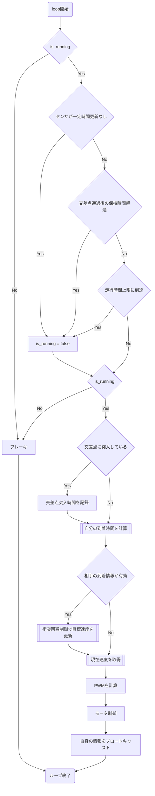
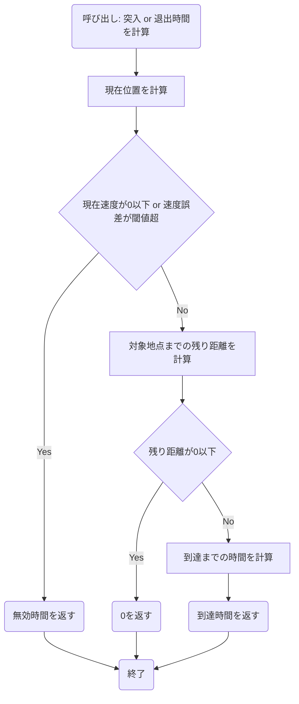
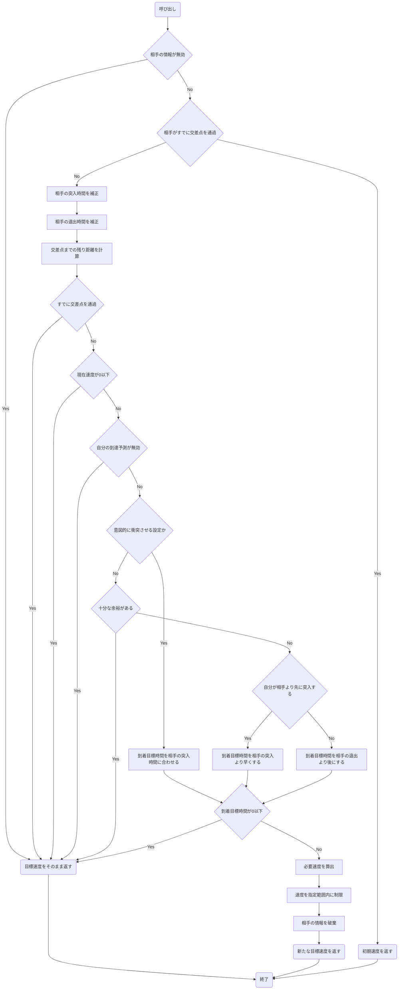
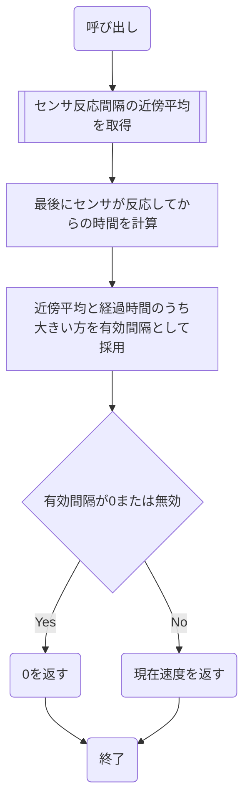

# 車両制御フローチャート（修正版）

## 車両制御フローチャート（メインループ）

3つの停止条件は独立したOR条件で、いずれか1つが成立した時点で以降の判定を行わずis_runningをfalseにします。停止指令（Eの判定）はここには存在せず、FINISHパケット受信時にコールバック側で非同期にis_runningがfalseになるだけです。

## 自分の到着時刻を計算するサブシステム

この関数は実際には2回呼ばれます。突入時間(`predict_time_to_intersection_us`)は交差点入口までの距離、退出時間(`predict_time_to_exit_intersection_us`)は入口＋出口距離＋車体長までの距離で計算するため、Eの「対象地点」が呼び出しごとに異なります。

## 衝突回避制御で目標速度を更新

「目標速度をそのまま返す」への合流点を複数箇所（B, I, J, K, N, R）すべて明示し、Cに統一しました。Lは「衝突回避するか」ではなく「意図的に衝突させる設定か」という意味です。

## 現在速度を取得

無効時間ではなく「0（停止扱い）」を返す点を修正しています。